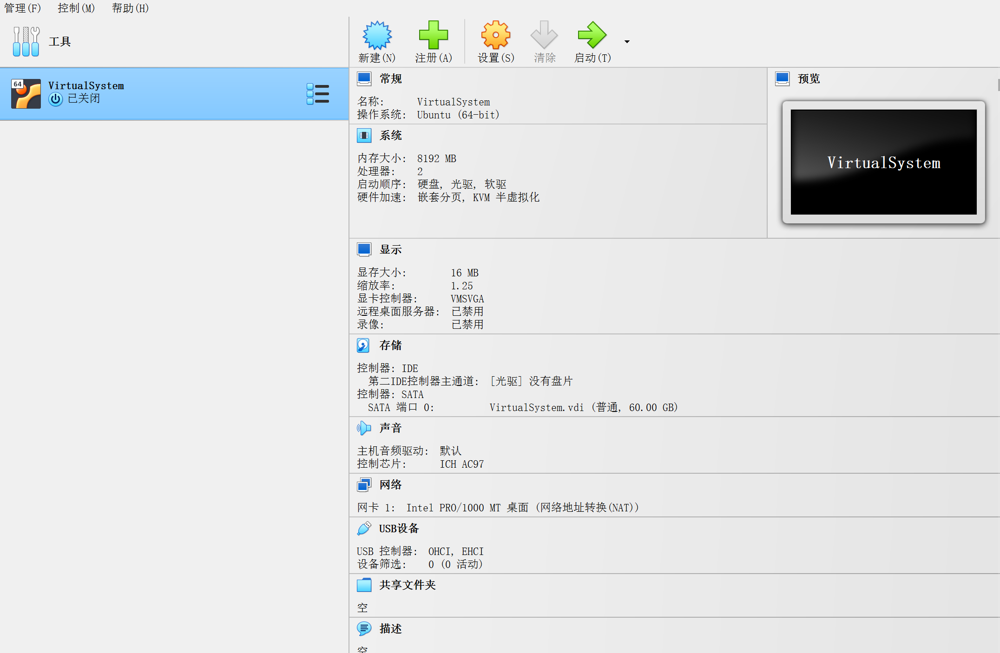
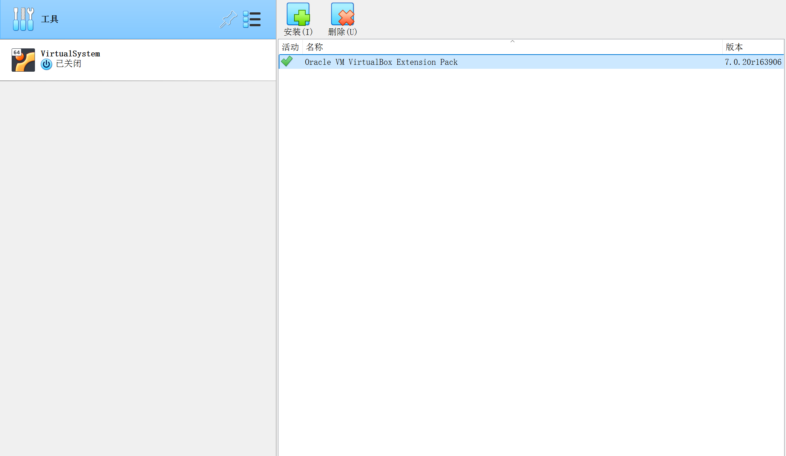
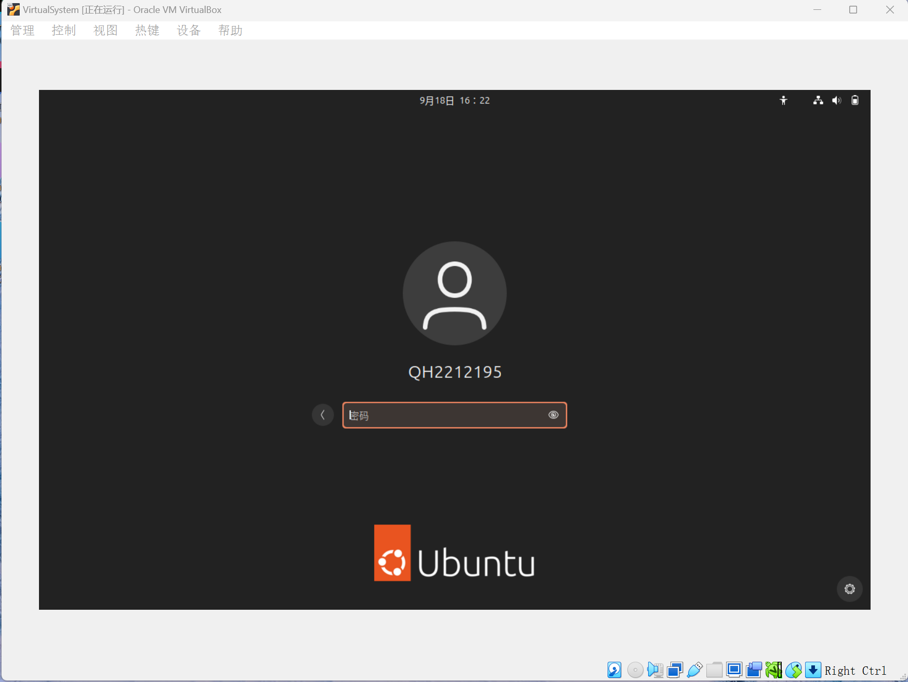
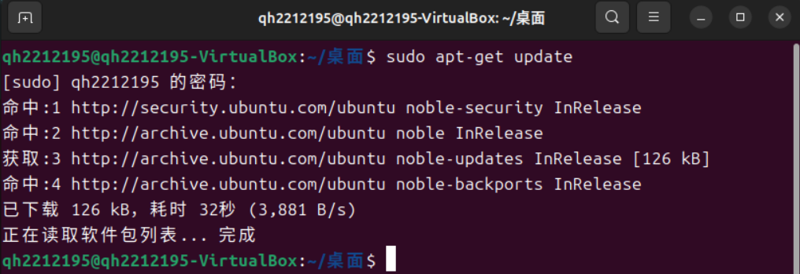
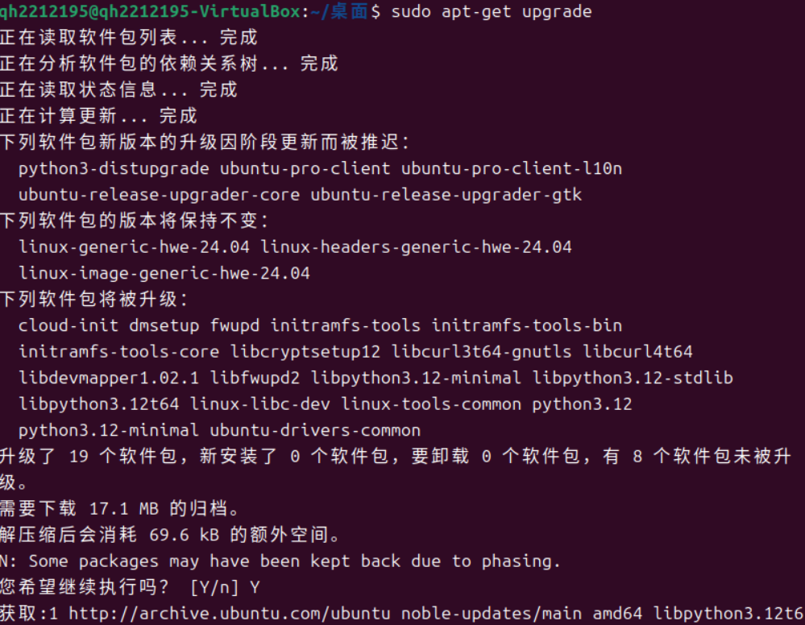
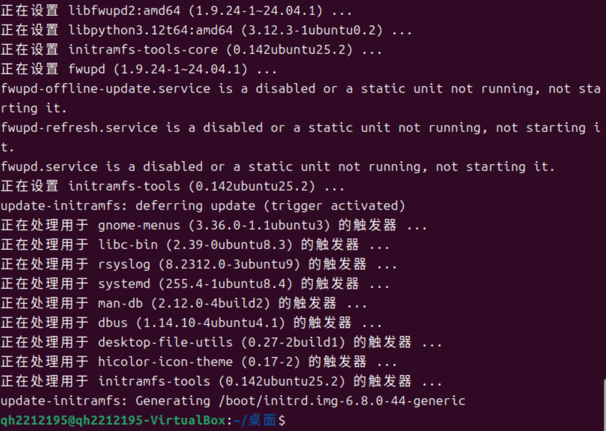
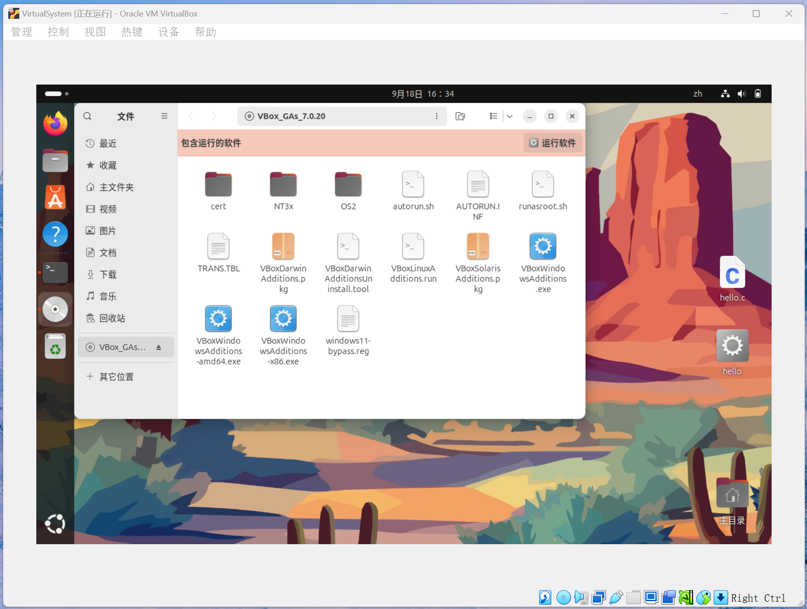
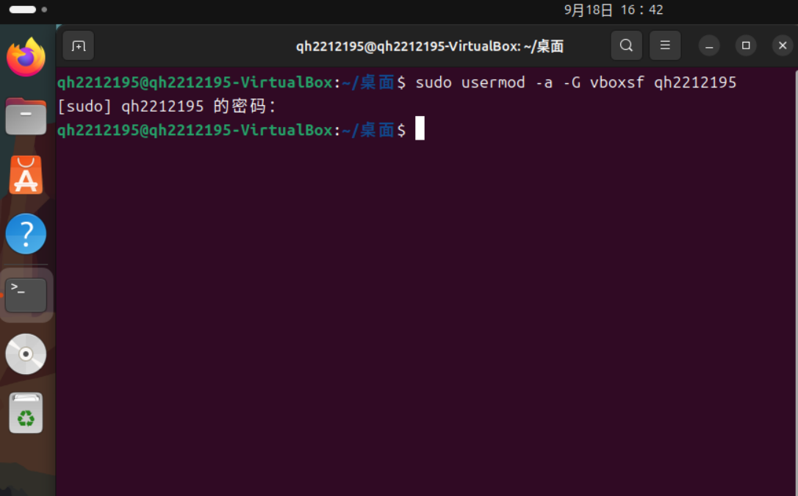
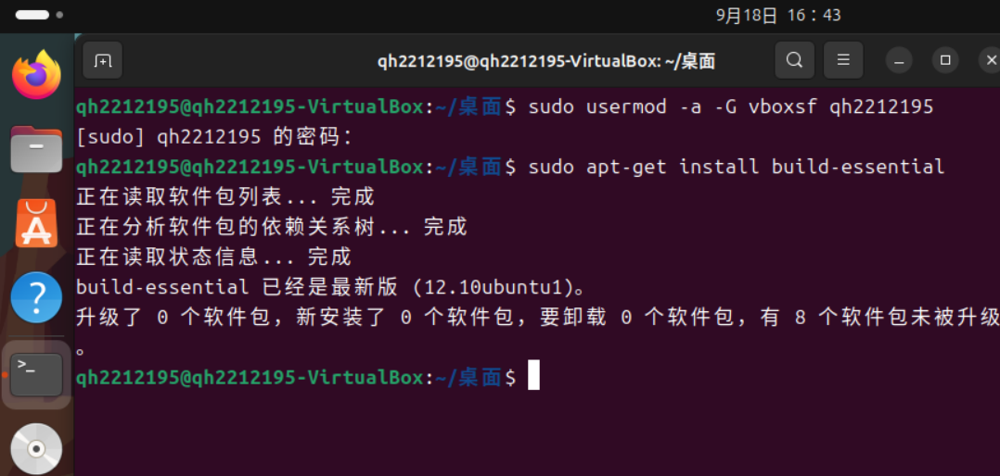
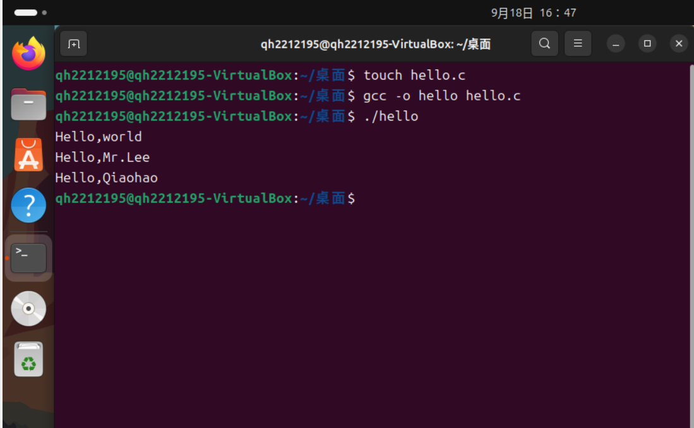

## <center>VirtualBox及Ubuntu安装总结实验报告</center>
#### <center>学院：软件学院</center> 
#### <center>学号：2212195</center> 
#### <center>姓名：&emsp;乔昊&emsp;</center>

### 实验过程
#### 安装虚拟机VirtualBox 
V7.0.20

#### 安装VirtualBox扩展包
V7.0.20

#### 安装Ubuntu并创建账户
用户名：QH2212195

#### 更新Ubuntu
```
sudo apt-get update
```

```
suod apt-get upgrade
```


#### 添加增强驱动

#### 添加共享文件夹权限
```
sudo usermod -a -G vboxsf qh2212195
```

#### 重启Ubuntu
```
Sudo reboot
```
#### 安装gcc编译器
```
sudo apt-get install build-essential
```

#### 运行hello.c文件
```
gcc -o hello hello.c
```
```
./hello
```

### 实验总结
&emsp;&emsp;在本次操作系统实验课上，我按照课件中的安装指引，成功地安装了VirtualBox虚拟机，并且配置好了Ubuntu/Linux系统，最后成功在虚拟机中编写并运行了“Hello，world”C语言程序。<br/>
&emsp;&emsp;本次实验安装VirtualBox和Ubuntu的过程比较顺利，在配置Ubuntu系统信息遇到了不知道如何选择系统配置信息的问题，在查阅相关文档和向老师同学请教之后顺利解决了问题。<br/>
&emsp;&emsp;在编写编译C语言文件的过程中，了解虚拟环境下该如何编写，运行程序，掌握了一些简单的Linux命令，给我带来了很大的收获。