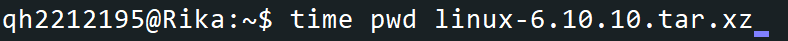
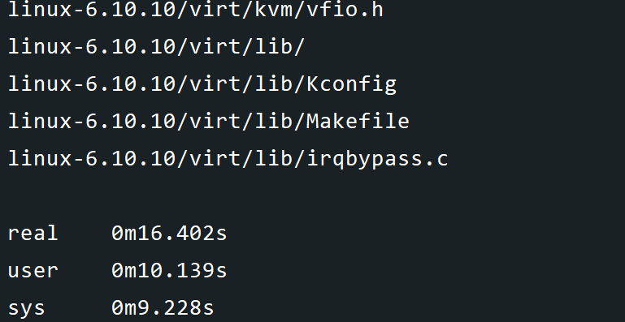
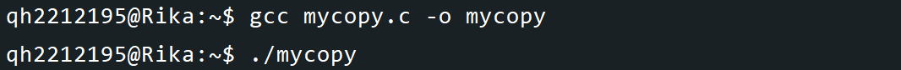
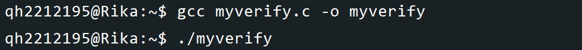
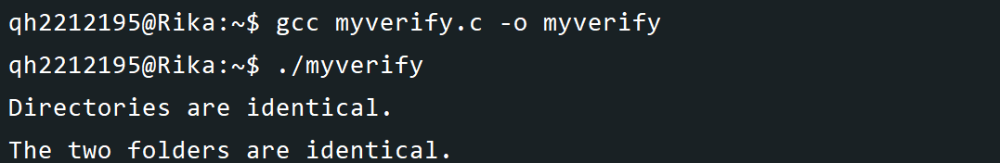
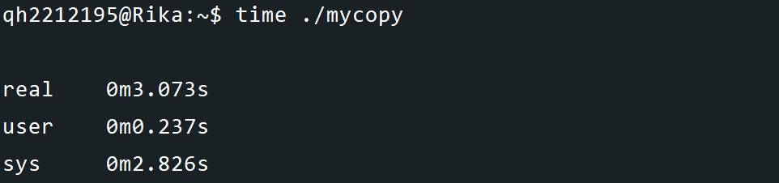
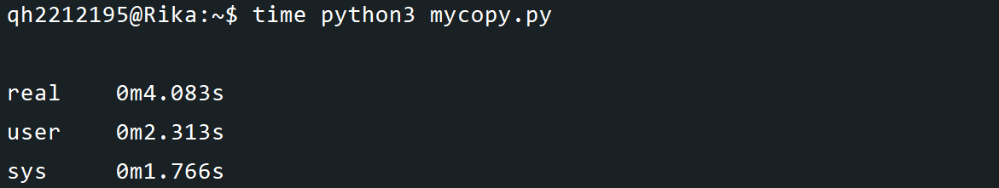

## <center>Linux-C语言实现文件夹拷贝与性能测试</center>
#### <center>学院：软件学院</center> 
#### <center>学号：2212195</center> 
#### <center>姓名：&emsp;乔昊&emsp;</center>

### 实验过程
#### 解压linux-6.10.10文件夹 


#### 编写C语言代码，实现文件夹拷贝
##### 创建mycopy.c文件
```
#include <stdio.h>
#include <stdlib.h>
#include <string.h>
#include <dirent.h>
#include <sys/stat.h>
#include <unistd.h>


void copyFile(const char *old_path, const char *new_path) {
    FILE *old_file = fopen(old_path, "rb");
    FILE *new_file = fopen(new_path, "wb");
    if (!old_file ||!new_file) {
        perror("Error opening files");
        return;
    }
    char buffer[1024];
    size_t bytesRead;
    while ((bytesRead = fread(buffer, 1, sizeof(buffer), old_file)) > 0) {
        fwrite(buffer, 1, bytesRead, new_file);
    }
    fclose(old_file);
    fclose(new_file);
}

void copyDirectory(const char *old_dir, const char *new_dir) {
    DIR *dir = opendir(old_dir);
    if (!dir) {
        perror("Error opening directory");
        return;
    }
    struct dirent *entry;
    while ((entry = readdir(dir))!= NULL) {
        if (strcmp(entry->d_name, ".") == 0 || strcmp(entry->d_name, "..") == 0) {
            continue;
        }
        char old_path[1024];
        char new_path[1024];
        snprintf(old_path, sizeof(old_path), "%s/%s", old_dir, entry->d_name);
        snprintf(new_path, sizeof(new_path), "%s/%s", new_dir, entry->d_name);
        struct stat st;
        stat(old_path, &st);
        if (S_ISDIR(st.st_mode)) {
            mkdir(new_path, st.st_mode);
            copyDirectory(old_path, new_path);
        } else {
            copyFile(old_path, new_path);
        }
    }
    closedir(dir);
}

int main() {
    const char *old_folder = "/home/qh2212195/linux-6.10.10";
    const char *new_folder = "/home/qh2212195/linux-6.10.10-copy-c";
    struct stat st;
    if (stat(old_folder, &st) == 0 && S_ISDIR(st.st_mode)) {
        if (stat(new_folder, &st) == 0 && S_ISDIR(st.st_mode)) {
            char choice;
            printf("目标文件夹已存在，是否覆盖？(y/n): ");
            scanf(" %c", &choice);
            if (choice == 'y' || choice == 'Y') {
                rmdir(new_folder);
                mkdir(new_folder, st.st_mode);
                copyDirectory(old_folder, new_folder);
            } else {
                printf("操作取消。\n");
            }
        } else {
            mkdir(new_folder, st.st_mode);
            copyDirectory(old_folder, new_folder);
        }
    } else {
        printf("源文件夹不存在。\n");
    }
    return 0;
}
```
##### gcc执行mycopy.c文件

##### 执行结果展示

#### 编写C语言代码，检验文件夹拷贝内容一致性
##### 创建myverify.c文件
```
#include <stdio.h>
#include <stdlib.h>
#include <string.h>
#include <dirent.h>
#include <sys/stat.h>

int compareFiles(const char *file1, const char *file2) {
    FILE *fp1 = fopen(file1, "rb");
    FILE *fp2 = fopen(file2, "rb");
    if (!fp1 ||!fp2) {
        perror("Error opening files");
        return 0;
    }
    char buffer1[1024], buffer2[1024];
    size_t bytesRead1, bytesRead2;
    do {
        bytesRead1 = fread(buffer1, 1, sizeof(buffer1), fp1);
        bytesRead2 = fread(buffer2, 1, sizeof(buffer2), fp2);
        if (bytesRead1!= bytesRead2 || memcmp(buffer1, buffer2, bytesRead1)!= 0) {
            fclose(fp1);
            fclose(fp2);
            return 0;
        }
    } while (bytesRead1 > 0 && bytesRead2 > 0);
    fclose(fp1);
    fclose(fp2);
    return 1;
}

int compareDirectories(const char *dir1, const char *dir2) {
    DIR *dp1 = opendir(dir1);
    DIR *dp2 = opendir(dir2);
    if (!dp1 ||!dp2) {
        perror("Error opening directories");
        return 0;
    }
    struct dirent *entry1, *entry2;
    int result = 1;
    while ((entry1 = readdir(dp1))!= NULL && result) {
        if (strcmp(entry1->d_name, ".") == 0 || strcmp(entry1->d_name, "..") == 0) {
            continue;
        }
        entry2 = readdir(dp2);
        if (!entry2) {
            printf("Directories are different.\n");
            result = 0;
            break;
        }
        if (strcmp(entry1->d_name, entry2->d_name)!= 0) {
            printf("Directories are different.\n");
            result = 0;
            break;
        }
        char path1[1024], path2[1024];
        snprintf(path1, sizeof(path1), "%s/%s", dir1, entry1->d_name);
        snprintf(path2, sizeof(path2), "%s/%s", dir2, entry2->d_name);
        struct stat st1, st2;
        stat(path1, &st1);
        stat(path2, &st2);
        if (S_ISDIR(st1.st_mode) && S_ISDIR(st2.st_mode)) {
            result = compareDirectories(path1, path2);
        } else if (S_ISREG(st1.st_mode) && S_ISREG(st2.st_mode)) {
            result = compareFiles(path1, path2);
        } else {
            printf("Directories are different.\n");
            result = 0;
            break;
        }
    }
    if (result && entry2!= NULL) {
        printf("Directories are different.\n");
        result = 0;
    }
    closedir(dp1);
    closedir(dp2);
    return result;
}

int main() {
    const char *folder1 = "folder1_path";
    const char *folder2 = "folder2_path";
    struct stat st1, st2;
    if (stat(folder1, &st1)!= 0 ||!S_ISDIR(st1.st_mode)) {
        printf("Folder1 does not exist or is not a directory.\n");
        return 1;
    }
    if (stat(folder2, &st2)!= 0 ||!S_ISDIR(st2.st_mode)) {
        printf("Folder2 does not exist or is not a directory.\n");
        return 1;
    }
    int areEqual = compareDirectories(folder1, folder2);
    if (areEqual) {
        printf("The two folders are identical.\n");
    } else {
        printf("The two folders are different.\n");
    }
    return 0;
}
```
##### gcc执行myverify.c文件

##### 执行结果展示

#### C语言与Python语言实现文件夹拷贝性能对比
##### C语言执行时间

##### Python语言执行时间

##### Python文件代码
```
import os
import shutil

def copy_folder(old_folder, new_folder):
    if not os.path.exists(new_folder):
        os.makedirs(new_folder)
    for item in os.listdir(old_folder):
        old_path = os.path.join(old_folder, item)
        new_path = os.path.join(new_folder, item)
        if os.path.isdir(old_path):
            copy_folder(old_path, new_path)
        else:
            shutil.copy2(old_path, new_path)

old_folder = "/home/qh2212195/linux-6.10.10"
new_folder = "/home/qh2212195/linux-6.10.10-copy-py"

copy_folder(old_folder, new_folder)

```
### 实验总结
&emsp;&emsp;在本次操作系统实验课上，我按照课件中的安装指引，安装了C语言代码执行的编译器，并且通过vim分别创建了mycopy.c、mycopy.py和myverify.c三个文件，分别实现了利用C语言、Python语言对文件夹进行拷贝，并且验证了代码的正确性。<br/>
&emsp;&emsp;本次实验让我掌握了更多的linux命令，学会了查看当前文件路径ls命令、检测程序执行时间time命令和执行python文件的python3命令。更重要的是，我掌握了利用C语言编写程序，实现对linux系统上文件夹的拷贝的能力，并且从实践中看到了C语言在执行程序的性能优于Python语言的一面。<br/>
&emsp;&emsp;总的来说，这次的实验虽然过程曲折，耗时较久，但给我带来了很大的收获，激发了我对学习linux操作系统的兴趣。