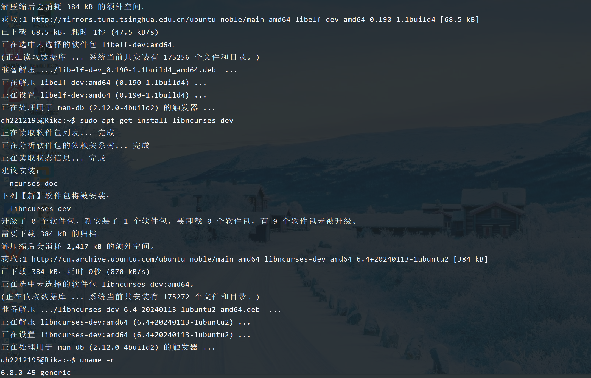

## <center>Linux-C语言实现文件夹拷贝与性能测试</center>
#### <center>学院：软件学院</center> 
#### <center>学号：2212195</center> 
#### <center>姓名：&emsp;乔昊&emsp;</center>

### 实验过程
#### 安装相关依赖并查看linux内核版本
 
#### 查看当前系统可用存储空间

#### 在 /usr/src 目录下建立软链接 linux

#### 配置最新的linux内核
##### 执行命令
```
cp /boot/config-`uname -r` .config
```
```
make oldconfig
```
##### 执行结果展示（成功）


#### 自定义最新版linux内核
##### 嵌入学号


#### 编译内核文件
##### 编译结果展示（成功）

##### 第二次验证


#### 安装最新版linux内核
##### 执行命令1
```
sudo make modules_install
```
##### 执行结果展示（成功）

##### 执行命令2
```
sudo make install
```
##### 执行结果展示（成功）


#### 查看最新版linux内核


### 实验总结
&emsp;&emsp;在本次操作系统实验课上，我按照课件中的安装指引，利用wget命令下载了linux-6.10.10版本的Linux内核，并安装了相关依赖。随后将配置最新版的Linux内核文件信息并成功将其编译。最后，安装并执行了最新版的Linux内核。<br/>
&emsp;&emsp;本次实验让我学会了如何配置linux内核文件信息，并学会在本地linux系统上编译并安装运行linux内核文件。此外，通过本次实验，我掌握了wget，ln等命令，学会了在linux操作系统上下载文件，创建软链接等操作。<br/>
&emsp;&emsp;总的来说，这次的实验虽然过程曲折，在编译内核文件时遇到诸多未曾见过的问题，但最终在查阅资料和向同学寻求帮助之后，成功解决了遇到的问题。