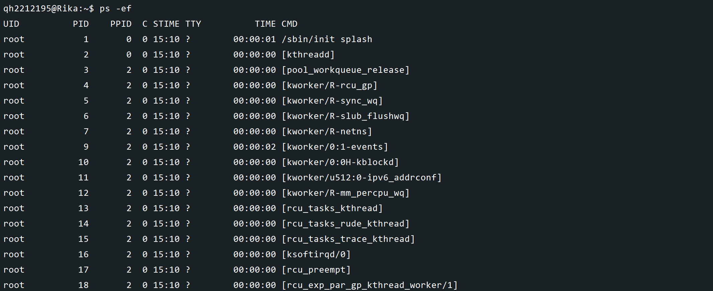
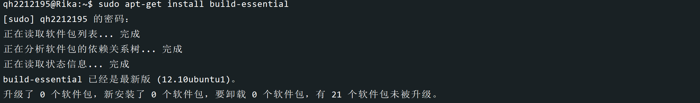
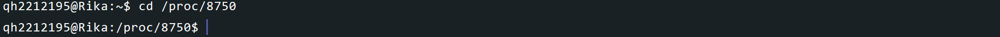
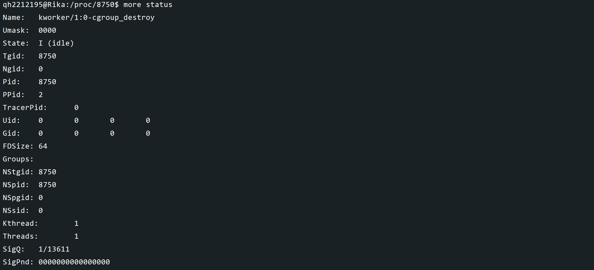
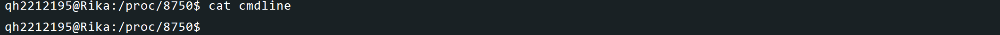
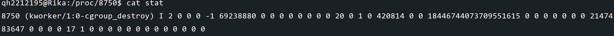
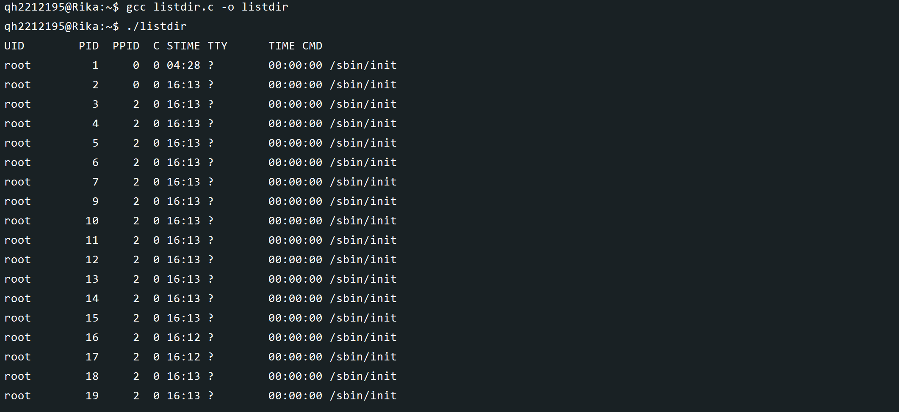

## <center>Linux-C语言实现文件夹拷贝与性能测试</center>
#### <center>学院：软件学院</center> 
#### <center>学号：2212195</center> 
#### <center>姓名：&emsp;乔昊&emsp;</center>

### 实验目标
#### 要求
编写C/C++程序，展示在用户模式下所有进程信息
#### 效果
类似 ```ps -ef``` 命令，展示 UID PID PPID TTY C CMD TIME 
STIME信息

### 实验准备
#### 安装GCC开发工具
执行 ```sudo apt-get install build-essential ``` 命令, 安装C/C++开发工具

#### 准备C/C++开发环境
本次实验采用**vim**编辑C语言文件
#### 查看系统状态
执行 ```cd /proc/8750``` 命令, 进入一个进程所在文件

执行 ```more status``` 命令，查看当前进程状态信息

执行 ```cat cmdline``` 命令，查看内核的命令行参数

执行 ```cat stat``` 命令， 显示 inode 内容

### 实验过程
执行 ```ps -ef``` 命令， 展示当前用户模式下的所有进程

编写C语言文件，展示进程的 UID PID PPID TTY C CMD TIME STIME 信息

代码展示
```
#include <stdio.h>
#include <stdlib.h>
#include <string.h>
#include <dirent.h>
#include <unistd.h>
#include <sys/types.h>
#include <pwd.h>
#include <time.h>
#include <sys/stat.h>
#include <sys/sysinfo.h>
#include <ctype.h>

// 辅助函数，用于安全地打开文件并处理错误
FILE* safe_fopen(const char* path, const char* mode) {
    FILE* file = fopen(path, mode);
    if (!file) {
        fprintf(stderr, "Error opening file: %s\n", path);
    }
    return file;
}

// 辅助函数，用于安全地关闭文件
void safe_fclose(FILE* file) {
    if (file) {
        fclose(file);
    }
}

// 解析进程信息并打印
void print_process_info(const char* pid) {
    char status_path[256], stat_path[256], cmdline_path[256], uid_str[32], tty[32], time_str[32], cmd[256];
    int ppid, cpu_usage;
    unsigned long stime, utime, cutime, cstime;
    struct passwd* pw = NULL;
    struct tm* start_time;
    time_t boot_time, proc_start_time;
    struct sysinfo info;

    snprintf(status_path, sizeof(status_path), "/proc/%s/status", pid);
    snprintf(stat_path, sizeof(stat_path), "/proc/%s/stat", pid);
    snprintf(cmdline_path, sizeof(cmdline_path), "/proc/%s/cmdline", pid);

    // 读取 UID
    FILE* status_file = safe_fopen(status_path, "r");
    if (status_file) {
        char line[256];
        while (fgets(line, sizeof(line), status_file)) {
            if (strncmp(line, "Uid:", 4) == 0) {
                sscanf(line, "Uid:\t%s", uid_str);
                break;
            }
        }
        safe_fclose(status_file);
    } else {
        return;
    }

    // 读取 PPID, STIME, UTIME, CUTIME, CSTIME
    FILE* stat_file = safe_fopen(stat_path, "r");
    if (stat_file) {
        fscanf(stat_file, "%*d %*s %*c %d %*d %*d %*d %*d %*u %*u %*u %*u %*u %lu %lu %lu %lu %*d %*d %*d %*d %*u %lu ", &ppid, &utime, &stime, &cutime, &cstime, &stime);
        safe_fclose(stat_file);
    } else {
        return;
    }

    // 计算进程开始时间
    boot_time = time(NULL) - sysconf(_SC_CLK_TCK) * (utime + stime + cutime + cstime);
    proc_start_time = boot_time + stime / sysconf(_SC_CLK_TCK);
    start_time = localtime(&proc_start_time);
    strftime(time_str, sizeof(time_str), "%H:%M", start_time);

    // 读取命令行
    FILE* cmdline_file = safe_fopen(cmdline_path, "r");
    if (cmdline_file) {
        if (fgets(cmd, sizeof(cmd), cmdline_file)) {
            if (cmd[0] == '\0') {
                snprintf(cmd, sizeof(cmd), "[%s]", pid);
            }
        }
        safe_fclose(cmdline_file);
    } else {
        return;
    }

    // 获取 TTY
    char tty_path[256];
    snprintf(tty_path, sizeof(tty_path), "/proc/%s/fd/0", pid);
    ssize_t len = readlink(tty_path, tty, sizeof(tty) - 1);
    if (len!= -1) {
        tty[len] = '\0';
    } else {
        strcpy(tty, "?");
    }

    sysinfo(&info);
    unsigned long total_time = utime + stime + cutime + cstime;
    double seconds = info.uptime - (total_time / sysconf(_SC_CLK_TCK));
    cpu_usage = (int)(100.0 * ((total_time / sysconf(_SC_CLK_TCK)) / seconds));

    // 使用 uid 中的用户 ID 获取 passwd 结构体
    uid_t user_id;
    if (sscanf(uid_str, "%u", &user_id)!= 1 || user_id <= 0) {
        user_id = -1;
    }
    pw = getpwuid(user_id);

    printf("%-8s %5s %5d %2d %5s %-8s %s %s\n", pw? pw->pw_name : "Unknown", pid, ppid, cpu_usage, time_str, tty, "00:00:00", cmd);
}

int main() {
    DIR* proc_dir;
    struct dirent* entry;

    proc_dir = opendir("/proc");
    if (!proc_dir) {
        perror("opendir");
        return 1;
    }

    printf("%-8s %5s %5s %2s %5s %-8s %s %s\n", "UID", "PID", "PPID", "C", "STIME", "TTY", "TIME", "CMD");

    while ((entry = readdir(proc_dir))!= NULL) {
        if (entry->d_type == DT_DIR && isdigit(entry->d_name[0])) {
            print_process_info(entry->d_name);
        }
    }

    closedir(proc_dir);
    return 0;
}
```
### 实验结论
本次实验成功通过编写C语言文件，实现了展示用户模式下进程的 UID PID PPID TTY C CMD TIME STIME 信息，结构上与 ```ps -ef``` 相同，但是由于时间差异，进程信息相似而不同。
### 实验总结
&emsp;&emsp;在本次操作系统实验课上，我按照课件中的安装指引，更新了C/C++开发工具，查看了系统进程的信息，并成功编写C语言代码实现了展示用户模式下进程的 UID PID PPID TTY C CMD TIME STIME 信息，结构与```ps -ef```命令相同，内容相似<br/>
&emsp;&emsp;本次实验让我学会了```ps -ef``` ```more``` ```cat```等命令，加深了我对linux命令的认识，更重要的是，我学会了如何查看linux系统中用户模式下进程信息，并且可以使用C语言编写代码查看用户进程信息，一方面提高了我的C语言代码能力，让我学会已有技术解决新的问题，另一方面，加深了我对linux系统进程的认识。<br/>
&emsp;&emsp;总的来说，这次的实验虽然过程曲折，在编译内核文件时遇到诸多未曾见过的问题，但最终在查阅资料和向同学寻求帮助之后，成功解决了遇到的问题。<br/>


