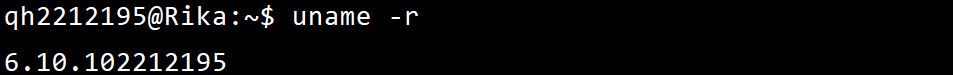
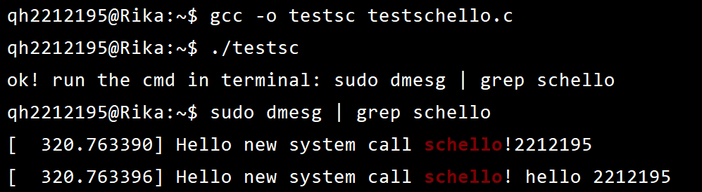

## <center>向内核添加新的系统调用并编译</center>
#### <center>学院：软件学院</center> 
#### <center>学号：2212195</center> 
#### <center>姓名：&emsp;乔昊&emsp;</center>

### 实验目标
1. ##### 向linux内核中添加一个新的系统调用
2. ##### 测试用户模式下新的系统调用
### 实验准备
#### 安装开发工具
本次实验选用 GCC 编译工具
##### 安装GCC
```
sudo apt-get install build-essential
```
#### 选择开发环境
vim文本编辑器+gcc编译器
#### 准备linux内核
本次实验使用linux-6.10.10版本的linux内核
##### 查看系统内核
```
uname -r
```

### 实验过程
#### 添加 asmlinkage 宏定义
##### 在 **/usr/src/linux/include/linux** 目录下
1. 进入 **syscalls.h** 文件
2. 找到 __#endif /* CONFIG_ARCH_HAS_SYSCALL_WRAPPER */__
3. 添加 **asmlinkage long sys_schello(void);**


#### 添加 SYSCALL_DEFINE0(schello) 函数
##### 在 **/usr/src/linux/kernel** 目录下
1. 进入 **sys.c** 文件
2. 找到 **SYSCALL_DEFINE0(gettid)** 函数
3. 添加 **SYSCALL_DEFINE0(schello)** 函数


#### 添加 common schello sys_schello 命令
##### 在 **/usr/src/linux/arch/x86/entry/syscalls** 目录下
1. 进入 **syscall_64.tbl**文件
2. 找到 **334 common memfd_secret   sys_memefd-secret**命令
3. 添加 **335 common schello sys_schello**命令


#### 重新编译内核
1. ##### 清理项目```make clean```
2. ##### 编译内核```make -j5```
3. ##### 拷贝编译模块```sudo make modules_install```
4. ##### 安装内核映像```sudo make install```
5. ##### 重新启动```reboot```
#### 查看系统内核
执行```uname -a```命令


#### 编写用户态测试程序testschello.c
```
#include <unistd.h>
#include <sys/syscall.h>
#include <sys/types.h>
#include <stdio.h>
#define __NR_schello 335
int main(int argc, char *argv[])
{
 syscall(__NR_schello);
 printf("ok! run the cmd in terminal: sudo dmesg | grep schello\n");
 return 0;
}
```

#### 编译testschello.c,并执行
```
gcc -o testsc testschello.c
./testsc
```
```
sudo dmesg | grep schello
```

### 实验总结
&emsp;&emsp;在本次操作系统实验课上，我按照课件中的安装指引，更新了C/C++开发工具，查看了linux内核版本，并成功在内核中添加了新的调用，并在用户模式下完成了新的系统调用<br/>
&emsp;&emsp;本次实验，我分别在syscalls.h文件中添加了asmlinkage long sys_schello(void);命令，在sys.c文件中添加了SYSCALL_DEFINE0(schello)函数，在syscall_64.tbl文件中添加了335 common schello sys_schello命令，并重新编译了系统内核，最后通过编写C语言代码成功实现新的系统调用。<br/>
&emsp;&emsp;总的来说，这次的实验虽然过程曲折，在编译内核文件时遇到诸多未曾见过的问题，但最终在查阅资料和向同学寻求帮助之后，成功解决了遇到的问题。<br/>