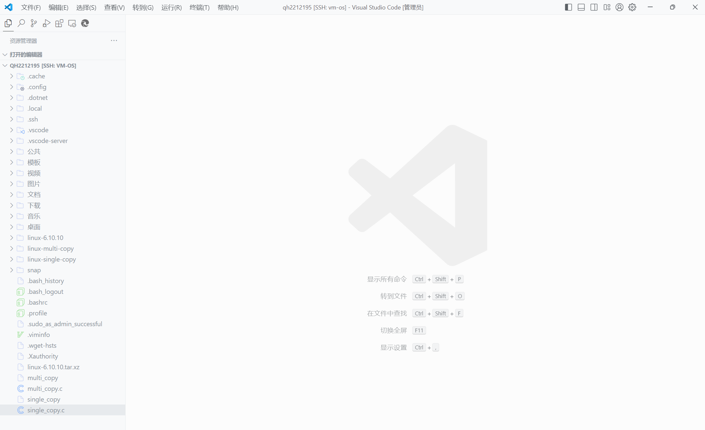
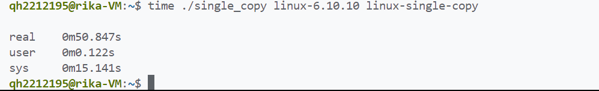
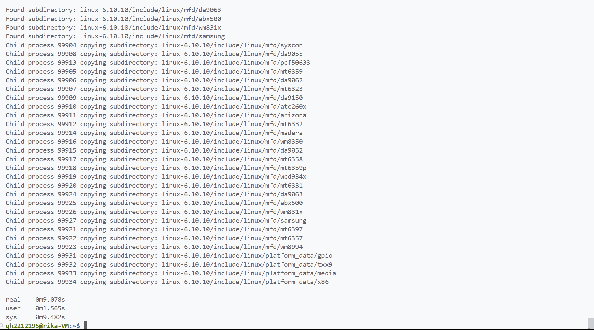

## <center>Linux-C语言实现多进程拷贝文件夹</center>
#### <center>学院：软件学院</center> 
#### <center>学号：2212195</center> 
#### <center>姓名：&emsp;乔昊&emsp;</center>

### 实验目标
编写C/C++语言程序，实现多进程拷贝文件夹，并验证文件夹拷贝的正确性
### 实验工具
1. **GCC编译器**  
   本次实验需要gcc编译器，编译C语言文件  
   执行 ```sudo apt-get install build-essential```  安装GCC  
2. **vscode编辑器**  
   本次实验，我通过在vscode上远程连接linux系统，使用vscode编辑C语言代码  
   
### 实验过程
#### 单进程拷贝文件夹
1. **实现代码**  
    ```
    #include <stdio.h>
    #include <stdlib.h>
    #include <string.h>
    #include <dirent.h>
    #include <sys/stat.h>
    #include <unistd.h>
    #include <fcntl.h>
    
    void copyDir(const char *source, const char     *destination) {
        struct stat sourceStat;
        if (stat(source, &sourceStat)!= 0) {
            perror("Error getting source     directory info");
            return;
        }
        if (mkdir(destination, sourceStat.    st_mode)!= 0) {
            perror("Error creating destination     directory");
            return;
        }
        DIR *dir = opendir(source);
        if (dir == NULL) {
            perror("Error opening source     directory");
            return;
        }
        struct dirent *entry;
        while ((entry = readdir(dir))!= NULL) {
            if (strcmp(entry->d_name, ".") ==     0 || strcmp(entry->d_name, "..") ==     0) {
                continue;
            }
            char sourcePath[1024];
            char destinationPath[1024];
            snprintf(sourcePath, sizeof    (sourcePath), "%s/%s", source,     entry->d_name);
            snprintf(destinationPath, sizeof    (destinationPath), "%s/%s",     destination, entry->d_name);
            struct stat entryStat;
            if (stat(sourcePath, &entryStat) ==     0) {
                if (S_ISDIR(entryStat.st_mode))     {
                    copyDir(sourcePath,     destinationPath);
                } else if (S_ISREG(entryStat.    st_mode)) {
                    copyFile(sourcePath,     destinationPath);
                }
            }
        }
        closedir(dir);
    }
    
    void copyFile(const char *sourceFilePath,     const char *destinationFilePath) {
        int source = open(sourceFilePath,     O_RDONLY);
        if (source == -1) {
            perror("Error opening source file");
            return;
        }
        int destination = open    (destinationFilePath, O_WRONLY |     O_CREAT | O_TRUNC, 0644);
        if (destination == -1) {
            perror("Error opening destination     file");
            close(source);
            return;
        }
        char buffer[4096];
        ssize_t bytesRead;
        while ((bytesRead = read(source,     buffer, sizeof(buffer))) > 0) {
            if (write(destination, buffer,     bytesRead)!= bytesRead) {
                perror("Error writing to     destination file");
            }
        }
        close(source);
        close(destination);
    }
    
    int main(int argc, char *argv[]) {
        if (argc!= 3) {
            fprintf(stderr, "Usage: %s     <source_directory>     <destination_directory>\n", argv    [0]);
            return 1;
        }
        copyDir(argv[1], argv[2]);
        return 0;
    }
    ```
2. **结果验证**  
   通过执行```diff -r```命令，验证两个文件夹及其内容是否一致  
     
   结果返回为空，证明单进程文件夹拷贝成功  
3. **执行时间**  
   通过执行```time ```命令，返回程序执行时间  
   
   
#### 多进程拷贝文件夹
1. 实现代码
    ```
    #include <stdio.h>
    #include <stdlib.h>
    #include <string.h>
    #include <dirent.h>
    #include <sys/stat.h>
    #include <unistd.h>
    #include <fcntl.h>
    #include <sys/wait.h>
    
    // 递归拷贝目录函数声明
    void copy_directory(const char *src, const     char *dst);
    // 文件拷贝函数
    void copy_file(const char *src, const char     *dst) {
        int source = open(src, O_RDONLY);
        if (source == -1) {
            perror("Error opening source file");
            return;
        }
        int destination = open(dst, O_WRONLY |     O_CREAT | O_TRUNC, 0644);
        if (destination == -1) {
            perror("Error opening destination     file");
            close(source);
            return;
        }
        char buffer[4096];
        ssize_t bytesRead;
        while ((bytesRead = read(source,     buffer, sizeof(buffer))) > 0) {
            if (write(destination, buffer,     bytesRead)!= bytesRead) {
                perror("Error writing to     destination file");
            }
        }
        close(source);
        close(destination);
    }
    
    // 递归拷贝目录函数（子进程执行）
    void copy_subdirectory(const char *src,     const char *dst) {
        copy_directory(src, dst);
    }
    
    // 递归拷贝目录函数（父进程调用）
    void copy_directory(const char *src, const     char *dst) {
        struct stat st;
        if (stat(src, &st)!= 0) {
            perror("Error stating source     directory");
            return;
        }
    
        // 创建目标目录
        if (mkdir(dst, st.st_mode)!= 0) {
            perror("Error creating destination     directory");
            return;
        }
    
        DIR *dir = opendir(src);
        if (dir == NULL) {
            perror("Error opening source     directory");
            return;
        }
    
        struct dirent *entry;
        int subdir_count = 0;
        while ((entry = readdir(dir))!= NULL) {
            // 跳过 "." 和 ".."
            if (strcmp(entry->d_name, ".") ==     0 || strcmp(entry->d_name, "..") ==     0) {
                continue;
            }
    
            // 构建源和目标路径
            char src_path[1024];
            char dst_path[1024];
            snprintf(src_path, sizeof    (src_path), "%s/%s", src,     entry->d_name);
            snprintf(dst_path, sizeof    (dst_path), "%s/%s", dst,     entry->d_name);
            if (stat(src_path, &st) == 0) {
                if (S_ISDIR(st.st_mode)) {
                    // 记录子目录名称和增加总数
                    printf("Found subdirectory:     %s\n", src_path);
                    subdir_count++;
                } else if (S_ISREG(st.st_mode))     {
                    // 拷贝文件
                    copy_file(src_path,     dst_path);
                } else if (S_ISLNK(st.st_mode))     {
                    // 处理链接文件
                    printf("Found symbolic     link: %s\n", src_path);
                }
            }
        }
        closedir(dir);
    
        // 创建子进程来拷贝子目录
        pid_t *child_pids = malloc(subdir_count     * sizeof(pid_t));
        int current_subdir = 0;
        dir = opendir(src);
        while ((entry = readdir(dir))!= NULL) {
            if (strcmp(entry->d_name, ".") ==     0 || strcmp(entry->d_name, "..") ==     0) {
                continue;
            }
    
            char src_path[1024];
            char dst_path[1024];
            snprintf(src_path, sizeof    (src_path), "%s/%s", src,     entry->d_name);
            snprintf(dst_path, sizeof    (dst_path), "%s/%s", dst,     entry->d_name);
            if (stat(src_path, &st) == 0 &&     S_ISDIR(st.st_mode)) {
                pid_t pid = fork();
                if (pid == 0) {
                    // 子进程
                    printf("Child process %d     copying subdirectory:     %s\n", getpid(), src_path);
                    copy_subdirectory(src_path,     dst_path);
                    exit(0);
                } else if (pid > 0) {
                    // 父进程
                    child_pids[current_subdir    ++] = pid;
                } else {
                    perror("Fork failed");
                }
            }
        }
        closedir(dir);
    
        // 等待所有子进程完成
        for (int i = 0; i < subdir_count; i++) {
            waitpid(child_pids[i], NULL, 0);
        }
        free(child_pids);
    }
    
    int main(int argc, char *argv[]) {
        if (argc!= 3) {
            fprintf(stderr, "Usage: %s     <source_directory>     <destination_directory>\n", argv    [0]);
            return 1;
        }
        copy_directory(argv[1], argv[2]);
        return 0;
    }
    ```
2. **结果验证**  
   通过执行```diff -r```命令，验证两个文件夹及其内容是否一致  
   
   结果返回为空，证明多进程文件夹拷贝成功  
3. **执行时间**  
   通过执行```time ```命令，返回程序执行时间  
   
   
#### 比较单进程与多进程拷贝文件夹的效率差异
&emsp;&emsp;经过对比发现，单进程拷贝文件夹耗时约50s，多进程拷贝文件夹耗时约9s。相比之下多进程拷贝文件夹效率远高于单进程拷贝。</br>
**本次实验多进程拷贝方式**</br>
&emsp;&emsp;本次实验，为父文件夹创建一个父进程，父进程通过遍历子文件夹数目，创建对应子文件夹数目的子进程。通过递归，最终的子进程进行文件拷贝。
### 实验总结
&emsp;&emsp;本次操作系统实验，用 C 语言实现多进程拷贝文件夹。这次实验，我通过设计代码让父进程遍历源文件夹、确定子文件夹数量并创建子进程。通过构建文件拷贝和递归拷贝目录函数和系统调用进行目录递归拷贝。还通过实现单进程拷贝作对比，比较单进程和多进程拷贝的效率差异。<br/>
&emsp;&emsp;技术上，这次实验让我熟练掌握 C 语言文件操作和进程管理调用。理解了多进程编程优势，尤其处理大规模任务时高效性。提升了我的问题解决能力，面对各种错误能冷静分析找到方案。<br/>
&emsp;&emsp;此次实验提升了我对操作系统的理解和应用能力。未来将继续深入学习相关知识，探索更多领域，如分布式系统等，保持学习热情，拓展知识面，为应对未来挑战做好准备。<br/>