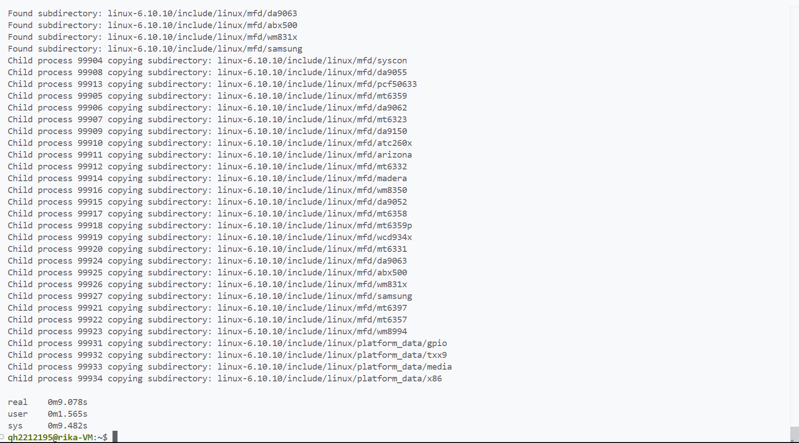

### <center>编写 C/C++程序实现多线程拷贝文件夹</center>

#### <center>学院：软件学院</center>

#### <center>学号：2212195</center>

#### <center>姓名：&emsp;乔昊&emsp;</center>

#### 实验目标

1. 编写 C/C++语言程序，实现多线程拷贝文件夹
2. 验证文件夹拷贝的正确性
3. 比较多进程和多线程的优劣

#### 实验工具
1. **GCC编译器**  
   本次实验使用gcc编译器，编译C语言程序文件   
   执行 ```sudo apt-get install build-essential```  安装gcc  
2. **vscode编辑器**  
   本次实验使用vscode上远程连接linux系统，使用vscode编辑C语言代码    
   
#### 实验过程
##### 编写C语言代码多线程拷贝文件夹
1. 实现代码
    ```
    #include <stdio.h>
    #include <stdlib.h>
    #include <string.h>
    #include <pthread.h>
    #include <dirent.h>
    #include <sys/stat.h>
    #include <unistd.h>
    #include <fcntl.h>
    #include <errno.h>
    
    #define BUFFER_SIZE 1024
    #define MAX_THREADS 4
    
    typedef struct {
        char *src;
        char *dst;
    } thread_args;
    
    void *copy_file(void *args) {
        thread_args *targs = (thread_args *)args;
        int src_fd, dst_fd;
        char buffer[BUFFER_SIZE];
        ssize_t bytes;
    
        src_fd = open(targs->src, O_RDONLY);
        if (src_fd < 0) {
            perror("Error opening source file");
            return NULL;
        }
    
        dst_fd = open(targs->dst, O_WRONLY |   O_CREAT |   O_TRUNC, 0644);
        if (dst_fd < 0) {
            perror("Error creating destination file");
            close(src_fd);
            return NULL;
        }
    
        while ((bytes = read(src_fd, buffer,     BUFFER_SIZE)) > 0) {
            if (write(dst_fd, buffer, bytes) != bytes) {
                perror("Error writing to destination     file");
                close(src_fd);
                close(dst_fd);
                return NULL;
            }
        }
    
        if (bytes < 0) {
            perror("Error reading source file");
            close(src_fd);
            close(dst_fd);
            return NULL;
        }
    
        close(src_fd);
        close(dst_fd);
        printf("Copied file from %s to %s\n",   targs->src,   targs->dst);
        free(targs->src);
        free(targs->dst);
        free(targs);
        return NULL;
    }
    
    int create_directory(const char *path) {
        char tmp[256];
        char *p;
        size_t len;
    
        snprintf(tmp, sizeof(tmp), "%s", path);
        len = strlen(tmp);
    
        if (tmp[len - 1] == '/') {
            tmp[len - 1] = 0;
        }
    
        for (p = tmp + 1; *p; p++) {
            if (*p == '/') {
                *p = 0;
                if (mkdir(tmp, 0777) != 0 && errno !=     EEXIST) {
                    perror("mkdir failed");
                    return -1;
                }
                *p = '/';
            }
        }
    
        if (mkdir(tmp, 0777) != 0 && errno != EEXIST) {
            perror("mkdir failed");
            return -1;
        }
    
        return 0;
    }
    
    void *copy_directory(void *args) {
        thread_args *targs = (thread_args *)args;
        DIR *dir;
        struct dirent *entry;
        struct stat statbuf;
        char src_path[1024];
        char dst_path[1024];
        pthread_t threads[MAX_THREADS];
        int thread_count = 0;
    
        if (!(dir = opendir(targs->src))) {
            perror("Failed to open directory");
            return NULL;
        }
    
        while ((entry = readdir(dir)) != NULL) {
            if (strcmp(entry->d_name, ".") == 0 ||   strcmp  (entry->d_name, "..") == 0) {
                continue;
            }
    
            snprintf(src_path, sizeof(src_path), "%s/  %s",   targs->src, entry->d_name);
            snprintf(dst_path, sizeof(dst_path), "%s/  %s",   targs->dst, entry->d_name);
    
            if (stat(src_path, &statbuf) == -1) {
                perror("Failed to stat file");
                continue;
            }
    
            if (S_ISDIR(statbuf.st_mode)) {
                if (create_directory(dst_path) == -1) {
                    continue;
                }
                thread_args *new_args = malloc(sizeof    (thread_args));
                new_args->src = strdup(src_path);
                new_args->dst = strdup(dst_path);
                if (pthread_create(&threads    [thread_count], NULL, copy_directory,     new_args) != 0) {
                    perror("Failed to create thread");
                    free(new_args->src);
                    free(new_args->dst);
                    free(new_args);
                } else {
                    thread_count++;
                    if (thread_count >= MAX_THREADS) {
                        for (int i = 0; i <   MAX_THREADS; i  ++) {
                            pthread_join(threads[i],     NULL);
                        }
                        thread_count = 0;
                    }
                }
            } else {
                thread_args *new_args = malloc(sizeof    (thread_args));
                new_args->src = strdup(src_path);
                new_args->dst = strdup(dst_path);
                if (pthread_create(&threads    [thread_count], NULL, copy_file,     new_args) != 0) {
                    perror("Failed to create thread");
                    free(new_args->src);
                    free(new_args->dst);
                    free(new_args);
                } else {
                    thread_count++;
                    if (thread_count >= MAX_THREADS) {
                        for (int i = 0; i <   MAX_THREADS; i  ++) {
                            pthread_join(threads[i],     NULL);
                        }
                        thread_count = 0;
                    }
                }
            }
        }
    
        for (int i = 0; i < thread_count; i++) {
            pthread_join(threads[i], NULL);
        }
    
        closedir(dir);
        return NULL;
    }
    
    int main(int argc, char *argv[]) {
        if (argc != 3) {
            fprintf(stderr, "Usage: %s <source>     <destination>\n", argv[0]);
            exit(EXIT_FAILURE);
        }
    
        thread_args *args = malloc(sizeof(thread_args));
        args->src = strdup(argv[1]);
        args->dst = strdup(argv[2]);
    
        pthread_t thread_id;
        if (pthread_create(&thread_id, NULL,     copy_directory, args) != 0) {
            perror("Failed to create thread");
            free(args->src);
            free(args->dst);
            free(args);
            exit(EXIT_FAILURE);
        }
    
        pthread_join(thread_id, NULL);
    
        printf("Directory copied successfully.\n");
        return 0;
    }
    ```
2. 代码结构分析
   - BUFFER_SIZE：定义用于读写文件的缓冲区大小
   - MAX_THREADS：定义同时运行的最大线程数
   - thread_args：定义结构体，用于传递源路径和目标路径给线程函数
   - copy_file(): 文件拷贝函数，接受一个thread_args结构体指针作为参数，并创建循环读取源文件内容到缓冲区，并写入目标文件，直到文件结束。
   - create_directory()：创建目录函数，接受一个目录路径作为参数，逐级创建目录。
   - copy_directory()：文件夹拷贝函数，对于每个文件，创建一个新线程来调用copy_file函数。如果线程数量达到MAX_THREADS，则等待一组线程完成。在所有条目处理完毕后，等待所有剩余线程完成。
3. 实现原理
在copy_directory函数中，对于每个子目录和文件，都会创建一个新线程来处理拷贝任务。使用一个线程数组来跟踪当前活跃的线程。当活跃线程数量达到MAX_THREADS时，等待这些线程完成，然后继续创建新线程。
##### 文件夹拷贝正确性验证
执行```diff -r linux-copy linux-6.10.10```命令  
结果返回空，说明文件夹拷贝成功

##### 单进程，多进程，多线程，cp命令效率比较
1. 单进程
   
2. 多进程
   
3. 多线程
   
4. cp命令
   

**结果**
|单进程|多进程|多线程|cp命令|
|---|---|---|---|
|50.847s|9.0782|1m14.792s|1m.0126s|

从实验结果来看，执行时间上多进程<单进程<cp命令<多线程

**分析**
- 单进程拷贝文件夹时，只能依次处理单个文件拷贝，效率较低
- 多进程拷贝文件夹时，每个进程可以独立运行，可以同时处理多个文件拷贝，但消耗系统资源大
- 多线程拷贝文件夹时，多个线程可以同时处理多个文件拷贝，但由于共享资源需要进行同步控制，部分线程可能会面临等待释放资源的情况，整体效率则会降低

#### 实验总结

&emsp;&emsp;本次实验中，我成功地用 C 语言实现了多线程拷贝文件夹。通过设计代码，我在程序中实现了对于源文件夹的遍历，确定子文件夹数量并合理地创建线程来处理拷贝任务。构建了文件拷贝和递归拷贝目录的函数，借助多线程技术实现了高效的文件夹拷贝。同时，通过与单进程拷贝进行对比，清晰地看到了单进程和多线程拷贝在效率上的差异。<br/>
&emsp;&emsp;从技术层面来看，这次实验让我更加熟练地掌握了 C 语言中的文件操作和多线程管理。深刻理解了多线程编程在处理大规模任务时的优势，多个线程能够同时处理不同的文件和子文件夹，极大地提高了拷贝效率。在实验过程中，面对各种可能出现的错误，我不断地进行分析和调试，这大大提升了我的问题解决能力，让我能够更加冷静地应对编程中出现的各种挑战。<br/>
&emsp;&emsp;此次实验显著提升了我对操作系统的理解和应用能力。在未来，我将继续深入学习相关知识，进一步探索更多的领域，例如分布式系统等。保持对知识的渴望和学习的热情，不断拓展自己的知识面，为应对未来可能出现的各种挑战做好充分的准备。同时，我也会尝试对本次实验的代码进行优化和改进，提高其稳定性和效率，以更好地应用于实际场景中。<br/>
