### <center>编写 C/C++程序 采用多线程实现生产者消费者问题</center>

#### <center>学院：软件学院</center>

#### <center>学号：2212195</center>

#### <center>姓名：&emsp;乔昊&emsp;</center>

#### 实验目标
1. 编写C语言程序,采用多线程的方式实现生产者消费者问题
#### 实验工具
1. **GCC编译器**  
   本次实验使用gcc编译器，编译C语言程序文件  
   * 安装gcc 
   执行```sudo apt-get install build-essential```命令
2. **vscode编辑器**  
   本次实验使用vscode上远程连接linux系统，使用vscode编辑C语言代码    
   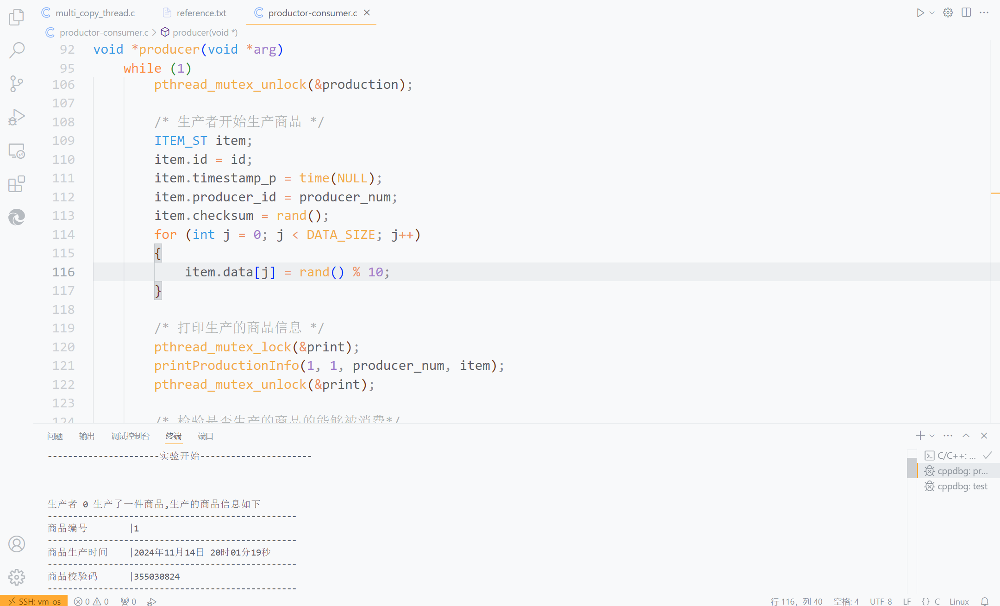
#### 实验过程
##### 编写C语言程序
1. **代码实现逻辑和原理分析**
   - 商品结构体定义
   ```
    typedef struct item_st
    {
        int id; // 商品id
        time_t timestamp_p; // 商品生产时间
        int producer_id; // 商品生产者id
        unsigned long checksum; // 商品校验码
        unsigned long data[DATA_SIZE]; // 商品详细数据
    } ITEM_ST;
   ```
   - 缓冲区结构定义
   ```
    typedef struct buffer_st
    {
        int id; // 缓冲区位置id
        int isempty; // 缓冲区位置是否有商品
        ITEM_ST item; // 缓冲区位置的商品
    } BUFFER_ST;
   ```
   - 生产消费宏定义信息
   ```
    #define N 4  // 共享缓冲区大小
    #define K 15 // 生产和消费的商品总数
    #define I 2  // 生产者数量
    #define J 0  // 消费者数量
    #define DATA_SIZE 256 // 商品数据大小
   ```
   - 互斥锁定义
   ```
    pthread_mutex_t mutex = PTHREAD_MUTEX_INITIALIZER; // 向缓冲区放入获取商品不重复
    pthread_mutex_t production = PTHREAD_MUTEX_INITIALIZER; // 生产商品不重复
    pthread_mutex_t consumption = PTHREAD_MUTEX_INITIALIZER; // 消费商品不重复
    pthread_mutex_t area = PTHREAD_MUTEX_INITIALIZER; // 限制消费者进入缓冲区,解决K值临界问题
    pthread_mutex_t print = PTHREAD_MUTEX_INITIALIZER; // 控制台打印商品完整信息
   ```
   - 信号量
   ```
    sem_t full; // 判断缓冲区是否为空
    sem_t empty; // 判断缓冲区是否已满
   ```
   - 打印商品信息
   ```
   void printProductionInfo(int type, int state, int id, ITEM_ST item)
    {
        if (state == 1)
        {
            if (type == 1)
            {
                printf("生产者 %d 生产了一件商品,生产的商品信息如下\n", id);
            }
            else
            {
                printf("消费者 %d 消费完了刚取出的商品,消费的商品信息如下    \n", id);
            }
            // 时间格式转换
            char time_buffer[80];
            strftime(time_buffer, sizeof(time_buffer), "%Y年%m月%d日 %H时    %M分%S秒", localtime(&item.timestamp_p));
            printf("-------------------------------------------------\n");
            printf("商品编号\t|%d\t\n",item.id);
            printf("-------------------------------------------------\n");
            printf("商品生产时间\t|%s\t\n",time_buffer);
            printf("-------------------------------------------------\n");
            printf("商品校验码\t|%lu\t\n",item.checksum);
            printf("-------------------------------------------------\n");
            printf("商品详细信息\t|");
            for (int i = 1; i <= DATA_SIZE/8; i++)
            {
                printf("%lu", item.data[i]);
                if(i%32==0) printf("\n");
            }
            printf    ("-------------------------------------------------\n\n");
        }
        else
        {
            if (type == 1)
            {
                printf("生产者 %d 将刚生产完的商品 %d 放入缓冲区\n", id,     item.id);
            }
            else
            {
                printf("消费者 %d 从缓冲区取出商品 %d \n", id, item.id);
            }
        }
    }
    ```
    1. 当生产者生产完一件商品时,打印生产者编号和生产的商品编号,时间,校验码,数据信息。
    2. 当消费者消费完一件商品时,打印消费者编号和消费的商品编号,时间,校验码,数据信息。
    3. 当生产者向缓冲区放入商品时,打印生产者编号和放入商品的编号。
    4. 当消费者从缓冲区取出商品时,打印消费者编号和取出商品的编号。
   - 生产者线程
    ```
    void *producer(void *arg)
    {
        int producer_num = *((int *)arg);
        while (1)
        {
            /* 生产者生产商品过程 */
            pthread_mutex_lock(&production);
            if (produced_count >= K) /* 生产数量已经达标 */
            {
                printf("生产者 %d 工作完成\n", producer_num);
                pthread_mutex_unlock(&production);
                return NULL;
            }
            int id = ++produced_count; // 生产数量不达标，生产新的商品
            pthread_mutex_unlock(&production);
    
            /* 生产者开始生产商品 */
            ITEM_ST item;
            item.id = id;
            item.timestamp_p = time(NULL);
            item.producer_id = producer_num;
            item.checksum = rand();
            for (int j = 0; j < DATA_SIZE; j++)
            {
                item.data[j] = rand() % 10;
            }
    
            /* 打印生产的商品信息 */
            pthread_mutex_lock(&print);
            printProductionInfo(1, 1, producer_num, item); 
            pthread_mutex_unlock(&print);
    
            /* 检验是否生产的商品的能够被消费*/
            if(J==0&&((in+1)%N==out)){
                printf("由于没有消费者且缓冲区已满无法存放新的商品,生产者 %d 结束工作\n", producer_num);
                return NULL;
    
            }
            /* 生产者准备进入临界区，等待检验缓冲区是否已满，并竞争互斥锁 */
            printf("生产者 %d 正在等待检验缓冲区是否已满，准备进入临界区\n",producer_num);
            sem_wait(&empty); // 生产者在此等待检验缓冲区是否已满
            pthread_mutex_lock(&mutex); // 生产者在此等待获得进入临界资源的锁
            printf("生产者 %d 获得了互斥锁,已进入临界区\n", producer_num);
    
            /* 生产者将生产的商品放入缓冲区 */
            buffer[in].item = item;
            buffer[in].isempty = 0;
            in = (in + 1) % N;
            
            /* 打印生产者放入商品的信息*/
            pthread_mutex_lock(&print);
            printProductionInfo(1, 0, producer_num, item);
            pthread_mutex_unlock(&print); 
    
            /* 生产者释放互斥锁，并增加临界区资源，唤醒一个等待着的消费者线程*/
            pthread_mutex_unlock(&mutex); 
            sem_post(&full);  
            printf("生产者 %d 释放了临界区的锁，已离开临界区\n\n", producer_num);
    
            // 随机等待一段时间
            int sleep_time = rand() % 3 + 1;
            usleep(sleep_time * 1000000);
        }
        return NULL;
    }
    ```
    1. 生产者首先判断是否生产达标
    2. 生产达标，结束生产者线程
    3. 生产不达标，生产者开始生产商品，商品数加1
    4. 生产者生产完商品，等待检验缓冲区是否已满，准备进入临界区
    5. 缓冲区已满，生产者线程阻塞等待，直到被消费者线程唤醒。
    6. 缓冲区未满，则生产者获得进入临界区的机会，等待获得临界区锁。
    7. 生产者获得临界区的锁，进入临界区
    8. 生产者将自己生产的商品放入临界区
    9. 生产者释放获得的临界区锁并增加1个缓冲区的商品数，离开临界区
   
   - 消费者线程 
    ```
    void *consumer(void *arg)
    {
        int consumer_num = *((int *)arg);
        while (1)
        {
            /* 检验消费者是否有资格进入缓冲区 */
            pthread_mutex_lock(&area);
            prepared_consumer++; // 准备进入缓冲区的消费者个数
            if (prepared_consumer > K - consumed_count) // 剩余可消费商品数小于准备进入缓冲区的消费者数
            {
                printf("消费者%d工作完成\n", consumer_num);
                pthread_mutex_unlock(&area);
                return NULL;
            }
            pthread_mutex_unlock(&area);
    
            /* 消费者准备进入临界区，先判断缓冲区是否有资源，再竞争互斥锁*/
            printf("消费者 %d 正在等待检验缓冲区是否有资源，准备进入临界区\n",consumer_num);
            sem_wait(&full); 
            pthread_mutex_lock(&mutex); 
            printf("消费者 %d 获得了互斥锁,已进入临界区\n", consumer_num);
    
            /* 消费者从缓冲区取出商品*/
            ITEM_ST item;
            item = buffer[out].item;
            buffer[out].isempty = 1;
            out = (out + 1) % N;
    
            /*打印消费者取出商品的信息*/
            pthread_mutex_lock(&print);
            printProductionInfo(0, 0, consumer_num, item);
            pthread_mutex_unlock(&print);
    
            /* 消费者离开临界区，释放占有的锁，并且增加缓冲区空位，从而唤醒等待着的生产者线程*/
            pthread_mutex_unlock(&mutex);
            sem_post(&empty);             
            printf("消费者 %d 释放了临界区的锁，已离开临界区\n\n", consumer_num);
    
            /* 消费者消费商品，商品作为共享资源需要互斥访问 */
            pthread_mutex_lock(&consumption);
            consumed_count++;
            prepared_consumer--; // 消费者消费完商品，需要释放缓冲区位置
            pthread_mutex_unlock(&consumption);
    
            /* 打印消费者消费商品信息 */
            pthread_mutex_lock(&print);
            printProductionInfo(0, 1, consumer_num, item);
            pthread_mutex_unlock(&print); 
    
            /* 随机等待一段时间 */
            int sleep_time = rand() % 3 + 1;
            usleep(sleep_time * 1000000);
        }
        return NULL;
    }
    ```
    1. 消费者首先检验是否有资格获得进入临界区的机会
    2. 若剩余最大消费商品数大于以获得资格进入临界区的消费者数，结束线程
    3. 否则，消费者等待检验缓冲区是否为空
    4. 缓冲区为空，消费者阻塞等待直到被生产者线程唤醒
    5. 缓冲区不为空，消费者获得进入临界区的机会，等待获得临界区的锁
    6. 消费者获得临界区的锁，进入临界区
    7. 消费者从缓冲区取走商品，
    8. 消费者释放获得的临界区的锁，并减少1个缓冲区的商品数，离开临界区
    9. 消费者开始消费已经获得商品，已消费的商品数加1
   
    - 主函数分析
    ```
    int main()
    {
        printf("本次生产者个数: %d\n消费者个数: %d\n生产商品总    数: %d\n缓冲区大小: %d\n", I, J, K, N);
        printf("----------------------实验开始    ----------------------\n\n\n\n");
        
        srand((unsigned int)time(NULL));
        sem_init(&full, 0, 0);
        sem_init(&empty, 0, N);
    
        pthread_t producers[I];
        pthread_t consumers[J];
        int producer_ids[I];
        int consumer_ids[J];
    
        // 初始化缓冲区为空
        for (int i = 0; i < N; i++)
        {
            buffer[i].isempty = 1;
        }
        // 判断是否能够正常生产
        if(I == 0){
                printf("由于生产者个数为0,无法生产产品,实验结束    \n");
                return 0;
        }
    
        for (int i = 0; i < I; i++)
        {
            producer_ids[i] = i;
            pthread_create(&producers[i], NULL, producer, &    producer_ids[i]);
        }
    
        for (int i = 0; i < J; i++)
        {
            consumer_ids[i] = i;
            pthread_create(&consumers[i], NULL, consumer, &    consumer_ids[i]);
        }
    
        for (int i = 0; i < I; i++)
        {
            pthread_join(producers[i], NULL);
            printf("生产者线程%d已经结束\n", i);
        }
    
        for (int i = 0; i < J; i++)
        {
            pthread_join(consumers[i], NULL);
            printf("消费者线程%d已经结束\n", i);
        }
    
        sem_destroy(&full);
        sem_destroy(&empty);
        pthread_mutex_destroy(&mutex);
    
        return 0;
    }
    ```
    1. 打印本次实验的数据
    2. 创建生产者线程
    3. 创建消费者线程
    4. 等待生产者线程退出工作
    5. 等待消费者线程退出工作
    6. 摧毁生产者，消费者线程

2. **特殊情况分析**
   - 生产者个数为0，消费者个数不为0
   因为商品无法生产，所以消费者会阻塞，因此实验中直接结束进程
   - 消费者个数为0，生产者个数不为0
   因为当生产者生产的商品数已经达到缓冲区上限时，商品无法被消费，所以生产者线程会堵塞，因此实验中当缓冲区达到上限时结束生产者线程
   - 生产商品数为0
   由于需要生产的商品数为0，生产者不会生产商品而直接结束线程，消费者不会消费商品也直接线程
   - 生产者个数，消费者个数均为0
   商品无法生产，无法被消费，程序直接退出
3. **实验案例输出**
   - 2个生产者，3个消费者，15个商品，缓冲区大小为4
  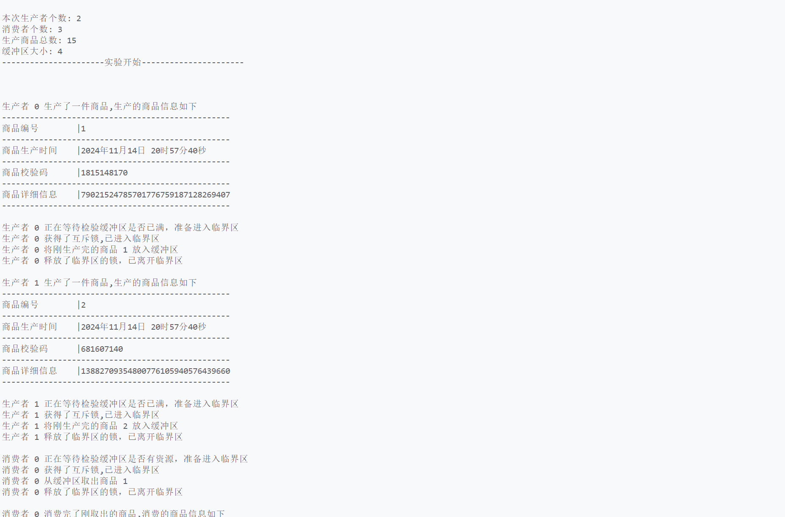
  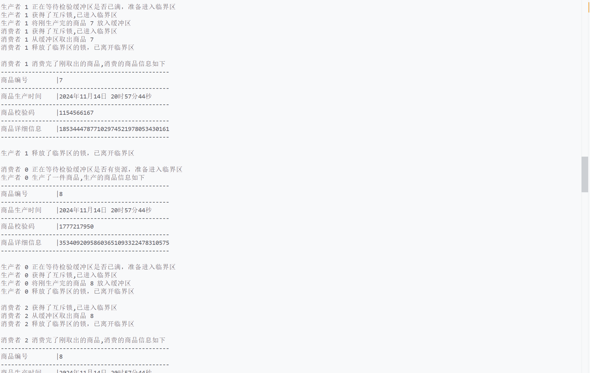
  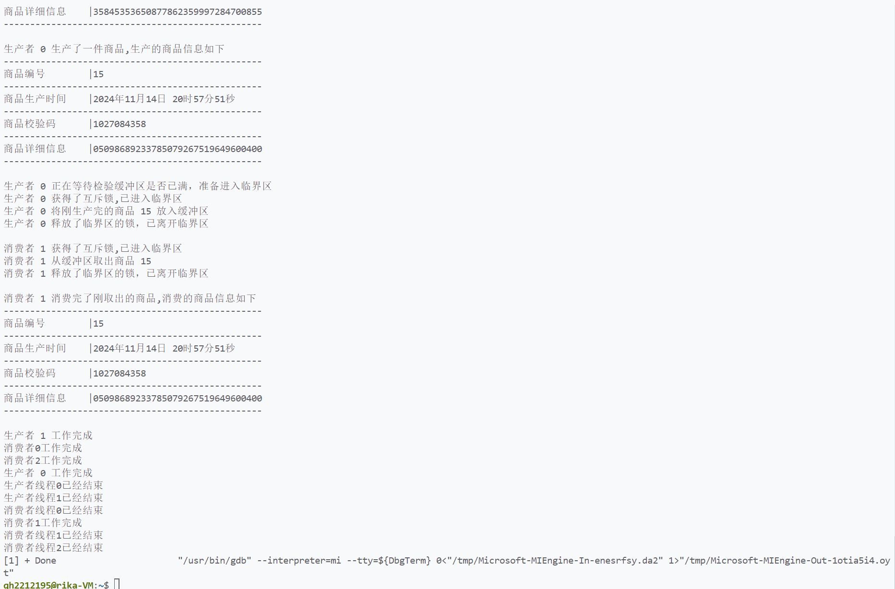
   - 0个生产者，3个消费者，15个商品，缓冲区大小为4
  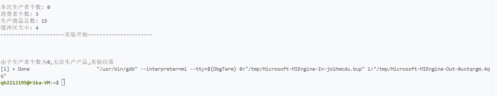
   - 2个生产者，0个消费者，15个商品，缓冲区大小为4
  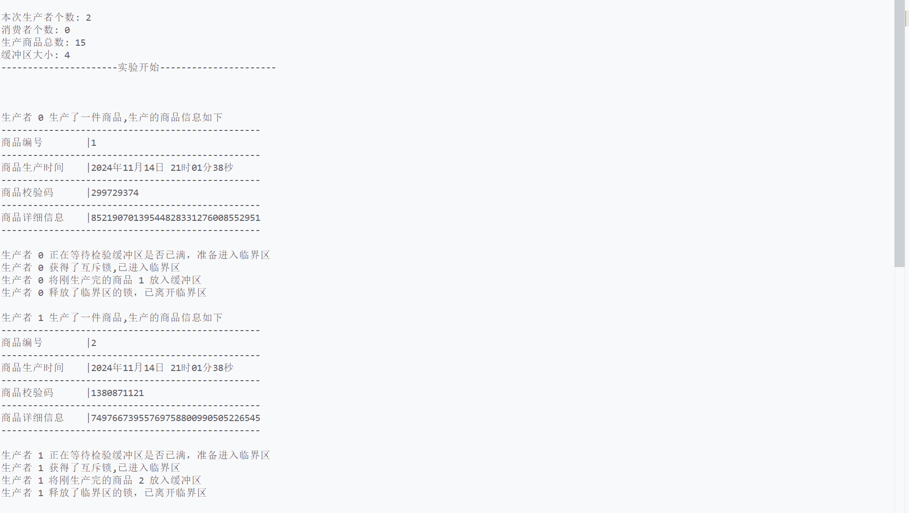
  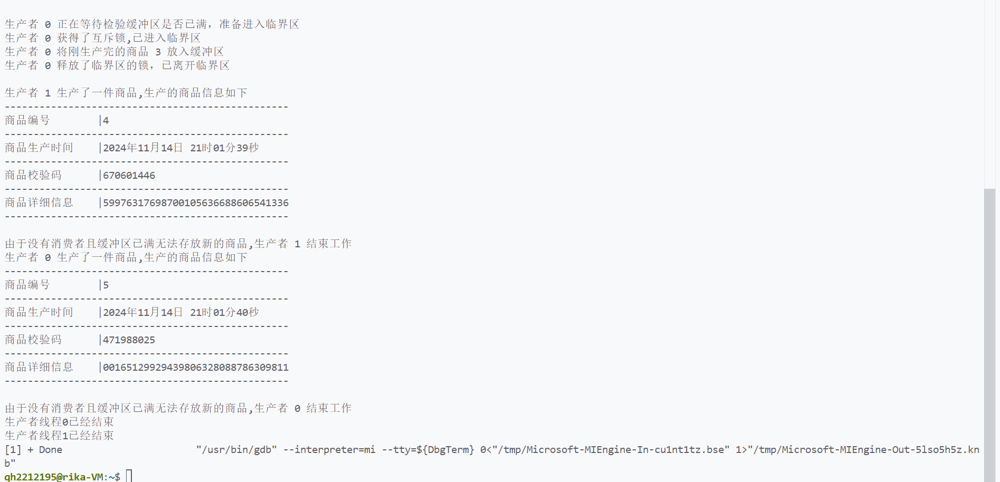
   - 2个生产者，3个消费者，15个商品，缓冲区大小为1
  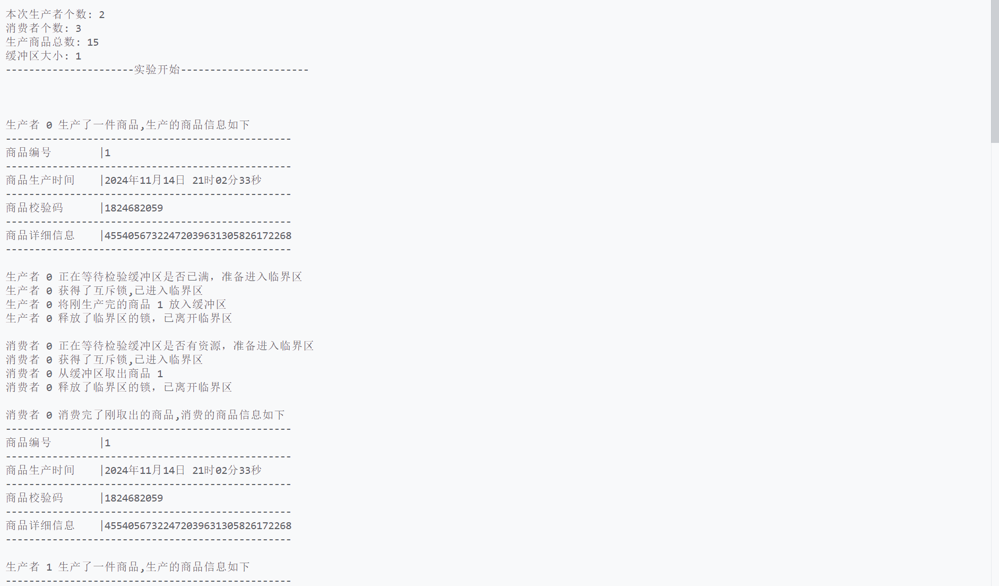
  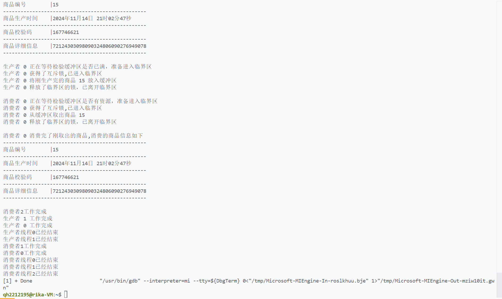
   - 0个生产者，0个消费者，15个商品，缓冲区大小为4
  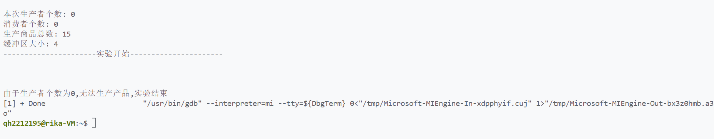
   - 2个生产者，3个消费者，0个商品，缓冲区大小为4
  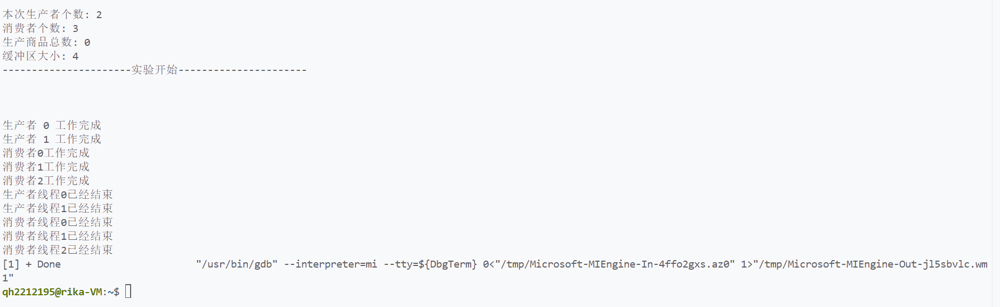

#### 实验总结
&emsp;&emsp;这次用 C 语言实现生产者 - 消费者问题的实验，让我对多线程编程和并发控制有了更深入的理解。我明白了互斥锁和信号量的原理及应用，像pthread_mutex_t类型的互斥锁用于保护缓冲区访问，sem_t类型的信号量协调生产和消费节奏。在实践中，我提升了代码逻辑分析与调试能力，知道如何通过合理结构和打印信息排查问题。<br/>
&emsp;&emsp;实验中遇到不少挑战，边界情况处理很关键。比如生产者或消费者数量为零、生产商品总数为零、缓冲区满或空等情况。当生产者为 0 而消费者不为 0 时，消费者会阻塞，我通过提前判断结束进程解决。调试时，线程调度顺序不确定会导致问题，我通过分析线程逻辑和添加打印信息来追踪、解决。这让我明白考虑各种情况和理解线程同步机制对多线程编程的重要性。<br/>
&emsp;&emsp;此次实验对我今后学习和实践意义重大。后续我会深入学习并发编程知识，探索更复杂的同步机制和多线程模型，比如优化多线程程序性能。实践中，编写多线程程序要全面规划，考虑资源竞争、死锁、饥饿等问题，善用调试工具和日志信息，这次实验让我更有热情提升编程能力。<br/>
#### 源代码
   ```
   #include <stdio.h>
   #include <stdlib.h>
   #include <pthread.h>
   #include <semaphore.h>
   #include <time.h>
   #include <unistd.h>
   
   #define N 4  // 共享缓冲区大小
   #define K 15 // 生产和消费的商品总数
   #define I 2  // 生产者数量
   #define J 0  // 消费者数量
   #define DATA_SIZE 256
   
   typedef struct item_st
   {
       int id;
       time_t timestamp_p;
       int producer_id;
       unsigned long checksum;
       unsigned long data[DATA_SIZE];
   } ITEM_ST;
   
   typedef struct buffer_st
   {
       int id;
       int isempty;
       ITEM_ST item;
       struct buffer_st *nextbuf;
   } BUFFER_ST;
   
   BUFFER_ST buffer[N];
   int in = 0;
   int out = 0;
   int produced_count = 0;
   int consumed_count = 0;
   
   pthread_mutex_t mutex = PTHREAD_MUTEX_INITIALIZER;
   pthread_mutex_t production =    PTHREAD_MUTEX_INITIALIZER;
   pthread_mutex_t consumption =    PTHREAD_MUTEX_INITIALIZER;
   pthread_mutex_t area = PTHREAD_MUTEX_INITIALIZER;
   pthread_mutex_t print = PTHREAD_MUTEX_INITIALIZER;
   
   int prepared_consumer = 0;
   
   sem_t full;
   sem_t empty;
   
   // 打印商品信息
   void printProductionInfo(int type, int state, int id,    ITEM_ST item)
   {
       if (state == 1)
       {
           if (type == 1)
           {
               printf("生产者 %d 生产了一件商品,生产的商品   信息如下\n", id);
           }
           else
           {
               printf("消费者 %d 消费完了刚取出的商品,消费   的商品信息如下\n", id);
           }
           // 时间格式转换
           char time_buffer[80];
           strftime(time_buffer, sizeof(time_buffer), "%Y   年%m月%d日 %H时%M分%S秒", localtime(&item.   timestamp_p));
           printf   ("--------------------------------------------   -----\n");
           printf("商品编号\t|%d\t\n",item.id);
           printf   ("--------------------------------------------   -----\n");
           printf("商品生产时间\t|%s\t\n",time_buffer);
           printf   ("--------------------------------------------   -----\n");
           printf("商品校验码\t|%lu\t\n",item.checksum);
           printf   ("--------------------------------------------   -----\n");
           printf("商品详细信息\t|");
           for (int i = 1; i <= DATA_SIZE/8; i++)
           {
               printf("%lu", item.data[i]);
               if(i%32==0) printf("\n");
           }
           printf   ("--------------------------------------------   -----\n\n");
       }
       else
       {
           if (type == 1)
           {
               printf("生产者 %d 将刚生产完的商品 %d 放入缓   冲区\n", id, item.id);
           }
           else
           {
               printf("消费者 %d 从缓冲区取出商品 %d \n",    id, item.id);
           }
       }
   }
   
   void *producer(void *arg)
   {
       int producer_num = *((int *)arg);
       while (1)
       {
           /* 生产者生产商品过程 */
           pthread_mutex_lock(&production);
           if (produced_count >= K) /* 生产数量已经达标 */
           {
               printf("生产者 %d 工作完成\n",    producer_num);
               pthread_mutex_unlock(&production);
               return NULL;
           }
           int id = ++produced_count; // 生产数量不达标，   生产新的商品
           pthread_mutex_unlock(&production);
   
           /* 生产者开始生产商品 */
           ITEM_ST item;
           item.id = id;
           item.timestamp_p = time(NULL);
           item.producer_id = producer_num;
           item.checksum = rand();
           for (int j = 0; j < DATA_SIZE; j++)
           {
               item.data[j] = rand() % 10;
           }
   
           /* 打印生产的商品信息 */
           pthread_mutex_lock(&print);
           printProductionInfo(1, 1, producer_num,    item); 
           pthread_mutex_unlock(&print);
   
           /* 检验是否生产的商品的能够被消费*/
           if(J==0&&((in+1)%N==out)){
               printf("由于没有消费者且缓冲区已满无法存放新   的商品,生产者 %d 结束工作\n",    producer_num);
               return NULL;
   
           }
           /* 生产者准备进入临界区，等待检验缓冲区是否已满，   并竞争互斥锁 */
           printf("生产者 %d 正在等待检验缓冲区是否已满，准   备进入临界区\n", producer_num);
           sem_wait(&empty); // 生产者在此等待检验缓冲区是   否已满
           pthread_mutex_lock(&mutex); // 生产者在此等待获   得进入临界资源的锁
           printf("生产者 %d 获得了互斥锁,已进入临界区\n",    producer_num);
   
           /* 生产者将生产的商品放入缓冲区 */
           buffer[in].item = item;
           buffer[in].isempty = 0;
           in = (in + 1) % N;
           
           /* 打印生产者放入商品的信息*/
           pthread_mutex_lock(&print);
           printProductionInfo(1, 0, producer_num, item);
           pthread_mutex_unlock(&print); 
   
           /* 生产者释放互斥锁，并增加临界区资源，唤醒一个等   待着的消费者线程*/
           pthread_mutex_unlock(&mutex); 
           sem_post(&full);  
           printf("生产者 %d 释放了临界区的锁，已离开临界区   \n\n", producer_num);
   
           // 随机等待一段时间
           int sleep_time = rand() % 3 + 1;
           usleep(sleep_time * 1000000);
       }
       return NULL;
   }
   
   void *consumer(void *arg)
   {
       int consumer_num = *((int *)arg);
       while (1)
       {
           /* 检验消费者是否有资格进入缓冲区 */
           pthread_mutex_lock(&area);
           prepared_consumer++; // 准备进入缓冲区的消费者个   数
           if (prepared_consumer > K -    consumed_count) // 剩余可消费商品数小于准备进入   缓冲区的消费者数
           {
               printf("消费者%d工作完成\n", consumer_num);
               pthread_mutex_unlock(&area);
               return NULL;
           }
           pthread_mutex_unlock(&area);
   
           /* 消费者准备进入临界区，先判断缓冲区是否有资源，   再竞争互斥锁*/
           printf("消费者 %d 正在等待检验缓冲区是否有资源，   准备进入临界区\n", consumer_num);
           sem_wait(&full); 
           pthread_mutex_lock(&mutex); 
           printf("消费者 %d 获得了互斥锁,已进入临界区\n",    consumer_num);
   
           /* 消费者从缓冲区取出商品*/
           ITEM_ST item;
           item = buffer[out].item;
           buffer[out].isempty = 1;
           out = (out + 1) % N;
   
           /*打印消费者取出商品的信息*/
           pthread_mutex_lock(&print);
           printProductionInfo(0, 0, consumer_num, item);
           pthread_mutex_unlock(&print);
   
           /* 消费者离开临界区，释放占有的锁，并且增加缓冲区   空位，从而唤醒等待着的生产者线程*/
           pthread_mutex_unlock(&mutex);
           sem_post(&empty);             
           printf("消费者 %d 释放了临界区的锁，已离开临界区   \n\n", consumer_num);
   
           /* 消费者消费商品，商品作为共享资源需要互斥访问    */
           pthread_mutex_lock(&consumption);
           consumed_count++;
           prepared_consumer--; // 消费者消费完商品，需要释   放缓冲区位置
           pthread_mutex_unlock(&consumption);
   
           /* 打印消费者消费商品信息 */
           pthread_mutex_lock(&print);
           printProductionInfo(0, 1, consumer_num, item);
           pthread_mutex_unlock(&print); 
   
           /* 随机等待一段时间 */
           int sleep_time = rand() % 3 + 1;
           usleep(sleep_time * 1000000);
       }
       return NULL;
   }
   
   int main()
   {
       printf("本次生产者个数: %d\n消费者个数: %d\n生产商品   总数: %d\n缓冲区大小: %d\n", I, J, K, N);
       printf("----------------------实验开始   ----------------------\n\n\n\n");
       
       srand((unsigned int)time(NULL));
       sem_init(&full, 0, 0);
       sem_init(&empty, 0, N);
   
       pthread_t producers[I];
       pthread_t consumers[J];
       int producer_ids[I];
       int consumer_ids[J];
   
       // 初始化缓冲区为空
       for (int i = 0; i < N; i++)
       {
           buffer[i].isempty = 1;
       }
       // 判断是否能够正常生产
       if(I == 0){
               printf("由于生产者个数为0,无法生产产品,实验结   束\n");
               return 0;
       }
   
       for (int i = 0; i < I; i++)
       {
           producer_ids[i] = i;
           pthread_create(&producers[i], NULL,    producer, &producer_ids[i]);
       }
   
       for (int i = 0; i < J; i++)
       {
           consumer_ids[i] = i;
           pthread_create(&consumers[i], NULL,    consumer, &consumer_ids[i]);
       }
   
       for (int i = 0; i < I; i++)
       {
           pthread_join(producers[i], NULL);
           printf("生产者线程%d已经结束\n", i);
       }
   
       for (int i = 0; i < J; i++)
       {
           pthread_join(consumers[i], NULL);
           printf("消费者线程%d已经结束\n", i);
       }
   
       sem_destroy(&full);
       sem_destroy(&empty);
       pthread_mutex_destroy(&mutex);
   
       return 0;
   }
   ```