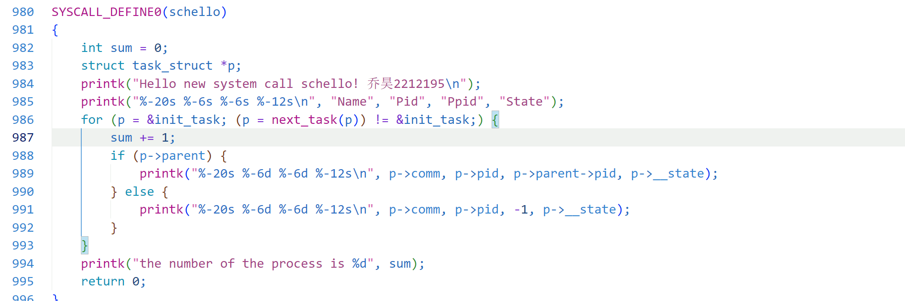
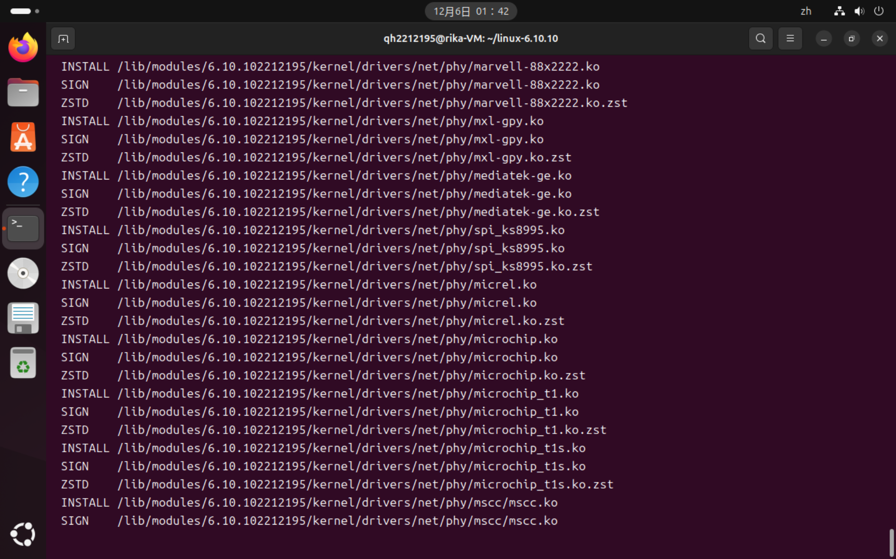
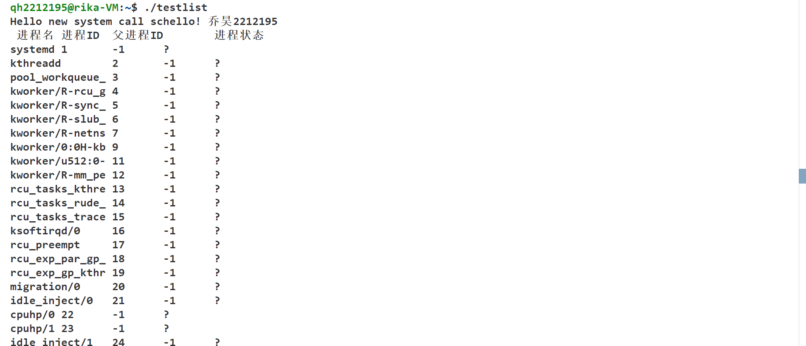

## <center>向 linux 内核添加系统调用实现展示进程</center>

#### <center>学院：软件学院</center>

#### <center>学号：2212195</center>

#### <center>姓名：&emsp;乔昊&emsp;</center>

### 实验目标

1. ##### 向 linux 内核中添加一个新的系统调用
2. ##### 测试用户模式下新的系统调用

### 实验准备

#### 安装开发工具

本次实验选用 GCC 编译工具

##### 安装 GCC

```
sudo apt-get install build-essential
```

#### 选择开发环境

vscode 编辑器

#### 准备 linux 内核

本次实验使用 linux-6.10.10 版本的 linux 内核

##### 查看系统内核

```
uname -a
```


### 实验过程

#### 添加 asmlinkage 宏定义

##### 在 **/usr/src/linux/include/linux** 目录下

1. 进入 **syscalls.h** 文件
2. 找到 **#endif /_ CONFIG_ARCH_HAS_SYSCALL_WRAPPER _/**
3. 添加 **asmlinkage long sys_schello(void);**

因为在第五次实验中,已经添加过 **asmlinkage long sys_schello(void);** 系统调用,所以不需要再次定义


#### 实现 SYSCALL_DEFINE0(schello) 函数

##### 在 **/usr/src/linux/kernel** 目录下

1. 进入 **sys.c** 文件
2. 找到 **SYSCALL_DEFINE0(gettid)** 函数
3. 添加 **SYSCALL_DEFINE0(schello)** 函数
4. 以下是实现列举进程信息的具体代码



**代码分析**

1. 设置 sum 变量计数器,统计当前系统中系统进程数
2. 创建指向 task_struct 结构体的指针 p,表示 linux 内核中的进程
3. 循环遍历进程,从 init_task 开始,直到 next_stack(p)不等于 init_task
4. 如果当前进程有父进程,打印进程名称,id,父进程,进程状态
5. 否则打印进程名称,id,-1,进程状态

#### 添加 common schello sys_schello 命令

##### 在 **/usr/src/linux/arch/x86/entry/syscalls** 目录下

1. 进入 **syscall_64.tbl**文件
2. 添加 **335 common schello sys_schello**命令

同样因为在第五次实验中,已经添加过 **335 common schello sys_schello** 命令,所以不需要再次添加


#### 重新编译内核

1. ##### 清理项目`make clean`
2. ##### 编译内核`make -j5`
3. ##### 拷贝编译模块`sudo make modules_install`
4. ##### 安装内核映像`sudo make install`
5. ##### 重新启动`reboot`


#### 查看系统内核

执行`uname -a`命令


#### 编写用户态测试程序
##### 测试代码
```
#include <unistd.h> 
#include <sys/syscall.h> 
#include <sys/types.h> 
#include <stdio.h> 
#define __NR_schello 335 
int main(int argc, char *argv[]) 
{ 
    syscall(__NR_schello); 
    printf("ok! run the cmd in terminal: sudo dmesg \n"); 
    return 0; 
} 
```
##### 执行结果


### 实验总结

&emsp;&emsp;本次实验重点是向 Linux 内核添加系统调用实现打印进程信息。首先在 /usr/src/linux/include/linux 的 syscalls.h 文件里处理 asmlinkage 宏定义（此次无需重复添加）；关键步骤是在 /usr/src/linux/kernel 的 sys.c 文件中实现 SYSCALL_DEFINE0 (schello) 函数，该函数实现了对进程信息的打印操作，通过设置计数器统计进程数量，利用指向 task_struct 结构体的指针遍历进程，根据进程有无父进程来分别打印进程名称、ID、父进程和进程状态等信息；在 /usr/src/linux/arch/x86/entry/syscalls 的 syscall_64.tbl 文件中添加 common schello sys_schello 命令（本次无需重复添加）；最后进行了重新编译内核相关操作，包括清理、编译、安装模块、安装映像和重启。<br/>
&emsp;&emsp;本次实验,给我带来了诸多的收获。在技术方面，学会了在内核不同文件中操作以实现功能，特别是在 sys.c 文件中编写代码实现对进程信息的准确打印。同时，让我掌握了内核编译和安装整套流程。在编程思维上，通过编写进程信息打印的代码，进一步提升了我对 C 语言和内核数据结构运用能力，加强了程序逻辑设计能力。<br/>
&emsp;&emsp;总的来说，这次实验激发了对 Linux 内核其他方面的兴趣。让我明白了在进行系统级开发时，需要对系统架构有深入的理解，并且要具备严谨的编程态度和良好的问题解决能力，才能确保开发工作的顺利进行。<br/>
