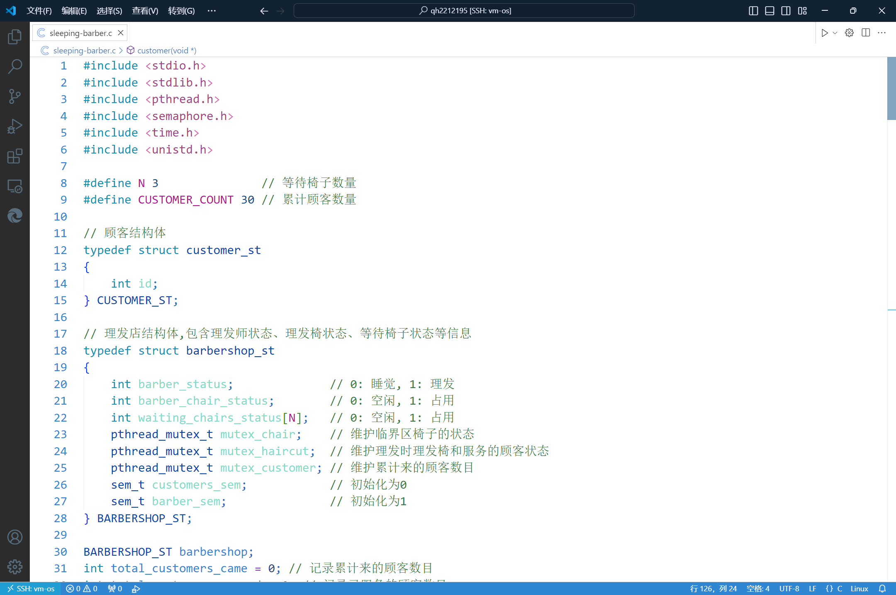

### <center>编写 C/C++程序 采用多线程实现睡眠理发师问题</center>

#### <center>学院：软件学院</center>

#### <center>学号：2212195</center>

#### <center>姓名：&emsp;乔昊&emsp;</center>

#### 实验目标
1. 编写C语言程序,采用多线程的方式实现睡眠理发师问题
#### 实验工具
1. **GCC编译器**  
   本次实验使用gcc编译器，编译C语言程序文件  
   * 安装gcc 
   执行```sudo apt-get install build-essential```命令
2. **vscode编辑器**  
   本次实验使用vscode上远程连接linux系统，使用vscode编辑C语言代码    
   {: width=500}
#### 实验过程
##### 编写C语言程序
**代码实现逻辑和原理分析**
1. 顾客结构体定义
```
typedef struct customer_st
{
    int id; // 顾客编号
} CUSTOMER_ST;
```
2. 理发店结构定义
```
typedef struct barbershop_st
{
    int barber_status;              // 0: 睡觉, 1: 理发
    int barber_chair_status;        // 0: 空闲, 1: 占用
    int waiting_chairs_status[N];   // 0: 空闲, 1: 占用
    pthread_mutex_t mutex_chair;    // 维护暂坐椅子的状态
    pthread_mutex_t mutex_haircut;  // 维护理发师状态
    pthread_mutex_t mutex_customer; // 维护累计到达的顾客数目状态
    sem_t customers_sem;            // 初始化为0
    sem_t barber_sem;               // 初始化为1
} BARBERSHOP_ST;
```
3. 顾客数量全局信息
```
int total_customers_came = 0; // 记录累计来的顾客数目
int total_customers_served = 0; // 记录已服务的顾客数目
```
4. 理发师理发函数
```
void *barber(void *arg)
{
    while (1)
    {
        /* 检查是否有人在暂坐椅子等待 */
        pthread_mutex_lock(&barbershop.mutex_chair);
        int waiting = 0; 
        for(int i =0;i < N; i++){
            if(barbershop.waiting_chairs_status[i] == 1){
                waiting = 1;
                break;
            }
        }
        pthread_mutex_unlock(&barbershop.mutex_chair);
        /* 检查是否已经累计来了30名顾客 */
        pthread_mutex_lock(&barbershop.mutex_customer);
        if (total_customers_came >= 31 && waiting == 0)
        {
            pthread_mutex_unlock(&barbershop.mutex_customer);
            printf("已经来了30名顾客,理发师进程结束\n");
            return NULL;
        }
        pthread_mutex_unlock(&barbershop.mutex_customer);
        /* 顾客信号量-1,如果为0,则一直等待 */
        printf("理发师等待顾客理发\n");
        sem_wait(&barbershop.customers_sem);
        /* 有顾客进入理发店并唤醒了理发师 */
        printf("理发师线程准备进入临界区\n");
        /* 维护理发时理发椅和正在理发的顾客状态 */
        pthread_mutex_lock(&barbershop.mutex_haircut);
        printf("理发师线程已进入临界区\n");
        // 随机生成理发时间
        int haircut_time = rand() % 5 + 1;
        printf("理发师开始理发,预计耗时 %d 秒\n", haircut_time);
        // 理发师开始为顾客理发
        barbershop.barber_status = 1;
        barbershop.barber_chair_status = 1;
        usleep(haircut_time * 1000000);
        // 理发结束
        barbershop.barber_status = 0;
        barbershop.barber_chair_status = 0;
        total_customers_served++;
        printf("理发师理发结束,耗时 %d 秒,已服务 %d 名顾客\n", haircut_time, total_customers_served);
        // 释放互斥锁,离开临界区,并唤醒可能等待的顾客
        pthread_mutex_unlock(&barbershop.mutex_haircut);
        printf("理发师离开临界区\n");
        /* 理发师信号量+1 */
        sem_post(&barbershop.barber_sem);

        printBarbershopStatus();
    }
    return NULL;
}
```
- 线程退出条件判断
  若暂坐椅子上没有顾客等待且累计来了30名顾客，则理发师线程结束
- 理发条件判断
  若等待理发的顾客信号量大于0，即有顾客等待理发，理发师进入临界区；否则，一直等待（睡觉）。
- 临界区资源维护（理发师状态，理发椅）
  理发师开始理发，需要维护理发师状态和理发椅状态不受其它线程的干扰，对临界区进行上锁
- 理发师理发
  理发师开始理发，随机生成理发时间，理发师处于忙碌，理发椅处于使用
- 结束理发
  时间结束后，服务的顾客数量加1，理发师处于睡觉，理发椅处于空闲，理发师离开临界区
- 理发师信号量加1
  随机唤醒一个正在等待的顾客（如果有）

5. 顾客理发函数
```
void *customer(void *arg)
{  
    CUSTOMER_ST *customer_info = (CUSTOMER_ST *)arg;
    int thread_num = customer_info->id;
    while (1)
    {
        // 随机生成顾客到达理发店的时间
        usleep(rand() % 10000000);
        /* 维护顾客id */
        pthread_mutex_lock(&barbershop.mutex_customer);
        /* 顾客到达 */
        total_customers_came++;
        /* 如果是第31位顾客,则线程退出 */
        if (total_customers_came >= 31)
        {
            printf("累计来了30名顾客,线程 %d 结束\n", thread_num);
            pthread_mutex_unlock(&barbershop.mutex_customer);
            return NULL;
        }
        /* 记录到达的顾客id */
        int customer_id = total_customers_came;
        printf("第 %d 位顾客到达\n", customer_id);
        pthread_mutex_unlock(&barbershop.mutex_customer);

        // 检查理发店状态
        if (barbershop.barber_status == 0) // 如果理发师在休息,则唤醒
        {
            /* 理发师信号量-1,若为0,则一直等待 */
            sem_wait(&barbershop.barber_sem); 
            printf("顾客 %d 叫醒了理发师\n", customer_id);
            /* 顾客信号量+1 */
            sem_post(&barbershop.customers_sem);
        }
        else
        {
            /* 维护等待座位的状态 */
            pthread_mutex_lock(&barbershop.mutex_chair);
            // 检查是否有空的等待椅子
            int i = 0;
            for (; i < N; i++)
            {
                if (barbershop.waiting_chairs_status[i] == 0) // 当前椅子为空
                {   
                    printf("顾客 %d 进入了临界区,坐在暂坐椅子 %d 上等待\n", customer_id, i+1);
                    barbershop.waiting_chairs_status[i] = 1;
                    break;
                }
            }
            pthread_mutex_unlock(&barbershop.mutex_chair);
            if (i == N) // 当前没有空椅子
            {
                printf("顾客 %d 因没有空的等待椅子而离开\n", customer_id);
            }
            else // 当前有空椅子,且顾客坐在第position张椅子等待
            {
                /* 等待理发师的信号量大于0 */
                sem_wait(&barbershop.barber_sem);
                /* 释放占用的椅子 */
                pthread_mutex_lock(&barbershop.mutex_chair);
                printf("理发师空闲,顾客 %d 离开了临界区(暂坐椅子),准备理发\n", customer_id);
                barbershop.waiting_chairs_status[i] = 0;
                pthread_mutex_unlock(&barbershop.mutex_chair);
                /* 将需要服务的顾客信号量+1 */
                sem_post(&barbershop.customers_sem);
            }
        }
    }
    // 打印理发店状态信息
    printBarbershopStatus();

    return NULL;
}
```
- 线程退出条件判断
  如果已经到达顾客数量超过30，则顾客离开，线程结束
- 顾客到达
  随机生成顾客到达时间，平均为50s，顾客进入理发店，累计到来的顾客数目加1
- 顾客暂坐椅子条件判断
  如果理发师此时正在睡觉，则唤醒理发师，理发师信号量减1，顾客信号量加1，否则进入临界区（暂坐椅子资源）
- 顾客离开条件判断
  顾客已经进入临界区，若暂坐椅子不足，则离开临界区，离开理发店；否则，暂坐椅子等待理发
- 顾客等待理发条件判断
  顾客已经进入临界区并坐在暂坐椅子上等待理发师空闲，若理发师空闲，顾客释放占用的暂坐椅子资源，离开临界区，准备理发，理发师信号量减1，顾客信号量加1。
6. 线程控制主函数
```
int main()
{
    // 初始化理发店状态
    barbershop.barber_status = 0;
    barbershop.barber_chair_status = 0;
    for (int i = 0; i < N; i++)
    {
        barbershop.waiting_chairs_status[i] = 0;
    }

    // 初始化互斥锁和信号量
    pthread_mutex_init(&barbershop.mutex_chair, NULL);
    pthread_mutex_init(&barbershop.mutex_haircut, NULL);
    // 初始化顾客数目为0
    sem_init(&barbershop.customers_sem, 0, 0);
    // 初始化理发师数目为1
    sem_init(&barbershop.barber_sem, 0, 1);

    // 创建理发师线程
    pthread_t barber_thread;
    pthread_create(&barber_thread, NULL, barber, NULL);

    // 创建顾客线程数组
    pthread_t customer_threads[5];
    CUSTOMER_ST customer_info[5];

    // 创建顾客线程并传入顾客信息
    for (int i = 0; i < 5; i++)
    {
        customer_info[i].id = i + 1;
        pthread_create(&customer_threads[i], NULL, customer, &customer_info[i]);
    }

    // 等待理发师线程结束
    pthread_join(barber_thread, NULL);

    // 等待顾客线程结束
    for (int i = 0; i < 5; i++)
    {
        pthread_join(customer_threads[i], NULL);
    }

    // 销毁互斥锁和信号量
    pthread_mutex_destroy(&barbershop.mutex_chair);
    pthread_mutex_destroy(&barbershop.mutex_haircut);
    sem_destroy(&barbershop.customers_sem);
    sem_destroy(&barbershop.barber_sem);

    return 0;
}
```
- 创建1个理发师线程，5个顾客线程
- 初始化理发师数量为1，顾客数量为0
#### 实验总结
&emsp;&emsp;本次实验围绕睡眠理发师问题展开，以 C 语言多线程编程实现。定义了顾客结构体存储顾客编号，理发店结构体包含理发师状态、理发椅状态、等待椅状态以及相关互斥锁与信号量。理发师线程循环检查等待顾客情况与累计顾客数，依此决定是否结束线程；若有顾客则进入理发流程，通过互斥锁保护临界区资源，随机生成理发时间并更新状态与服务计数，理发结束后释放资源并唤醒顾客。顾客线程随机生成到达时间，先更新累计顾客数，依据理发师及等待椅状态进行不同操作，可能唤醒理发师、占用等待椅等待或因无空椅而离开。<br/>
&emsp;&emsp;本次实验成功有效模拟睡眠理发师场景的多线程程序。通过合理运用互斥锁和信号量，精准地实现了理发师与顾客之间复杂的交互逻辑，准确地控制了线程对共享资源的访问，保证了理发店运营过程中各种状态的正确切换与信息记录。例如，顾客的有序到达、等待与理发，理发师的适时工作与休息，以及服务顾客数量的精确统计等功能均得以良好呈现，充分展示了多线程技术在解决此类并发问题上的有效性与可靠性，达成了实验预期目标，验证了相关理论知识在实际编程中的可行性。<br/>
&emsp;&emsp;通过本次睡眠理发师问题的实验，我对多线程编程有了更为深入且系统的理解与掌握。在实验过程中，深切体会到多线程环境下资源竞争与同步控制的复杂性，也认识到合理运用互斥锁和信号量对于保障程序正确性和稳定性的关键意义。从技术层面而言，不仅熟练了线程的创建、销毁以及线程函数的编写，更重要的是学会了如何精准地分析并发场景中的各种状态变化与逻辑关系，进而巧妙地设计出相应的控制机制。这一过程极大地提升了我的逻辑思维与问题解决能力，使我在面对复杂的并发编程挑战时，能够更加从容地进行思考与应对。<br/>
#### 输出结果
```
理发师等待顾客理发
第 1 位顾客到达
顾客 1 叫醒了理发师
理发师线程准备进入临界区
理发师线程已进入临界区
理发师开始理发,预计耗时 1 秒
理发师理发结束,耗时 1 秒,已服务 1 名顾客
理发师离开临界区

理发店状态如下
------------------------------------------
理发师状态: 睡觉
等待椅子状态: 空闲 空闲 空闲 
------------------------------------------


理发师等待顾客理发
第 2 位顾客到达
顾客 2 叫醒了理发师
理发师线程准备进入临界区
理发师线程已进入临界区
理发师开始理发,预计耗时 5 秒
第 3 位顾客到达
顾客 3 进入了临界区,坐在暂坐椅子 1 上等待
第 4 位顾客到达
顾客 4 进入了临界区,坐在暂坐椅子 2 上等待
第 5 位顾客到达
顾客 5 进入了临界区,坐在暂坐椅子 3 上等待
理发师理发结束,耗时 5 秒,已服务 2 名顾客
理发师离开临界区

理发店状态如下
------------------------------------------
理发师状态: 睡觉
等待椅子状态: 占用 占用 占用 
------------------------------------------


理发师等待顾客理发
理发师空闲,顾客 3 离开了临界区(暂坐椅子),准备理发
理发师线程准备进入临界区
理发师线程已进入临界区
理发师开始理发,预计耗时 3 秒
第 6 位顾客到达
顾客 6 进入了临界区,坐在暂坐椅子 1 上等待
理发师理发结束,耗时 3 秒,已服务 3 名顾客
理发师离开临界区
理发师空闲,顾客 4 离开了临界区(暂坐椅子),准备理发

理发店状态如下
------------------------------------------
理发师状态: 睡觉
等待椅子状态: 占用 空闲 占用 
------------------------------------------


理发师等待顾客理发
理发师线程准备进入临界区
理发师线程已进入临界区
理发师开始理发,预计耗时 1 秒
第 7 位顾客到达
顾客 7 进入了临界区,坐在暂坐椅子 2 上等待
理发师理发结束,耗时 1 秒,已服务 4 名顾客
理发师离开临界区

理发店状态如下
------------------------------------------
理发师状态: 睡觉
等待椅子状态: 占用 占用 占用 
------------------------------------------


理发师等待顾客理发
理发师空闲,顾客 5 离开了临界区(暂坐椅子),准备理发
理发师线程准备进入临界区
理发师线程已进入临界区
理发师开始理发,预计耗时 4 秒
第 8 位顾客到达
顾客 8 进入了临界区,坐在暂坐椅子 3 上等待
第 9 位顾客到达
顾客 9 因没有空的等待椅子而离开
理发师理发结束,耗时 4 秒,已服务 5 名顾客
理发师离开临界区
理发师空闲,顾客 6 离开了临界区(暂坐椅子),准备理发

理发店状态如下
------------------------------------------
理发师状态: 睡觉
等待椅子状态: 空闲 占用 占用 
------------------------------------------


理发师等待顾客理发
理发师线程准备进入临界区
理发师线程已进入临界区
理发师开始理发,预计耗时 2 秒
第 10 位顾客到达
顾客 10 进入了临界区,坐在暂坐椅子 1 上等待
理发师理发结束,耗时 2 秒,已服务 6 名顾客
理发师离开临界区

理发店状态如下
------------------------------------------
理发师状态: 睡觉
等待椅子状态: 占用 占用 占用 
------------------------------------------


理发师等待顾客理发
理发师空闲,顾客 7 离开了临界区(暂坐椅子),准备理发
理发师线程准备进入临界区
理发师线程已进入临界区
理发师开始理发,预计耗时 2 秒
理发师理发结束,耗时 2 秒,已服务 7 名顾客
理发师离开临界区

理发店状态如下
------------------------------------------
理发师状态: 睡觉
等待椅子状态: 占用 空闲 占用 
------------------------------------------


理发师等待顾客理发
理发师空闲,顾客 8 离开了临界区(暂坐椅子),准备理发
理发师线程准备进入临界区
理发师线程已进入临界区
理发师开始理发,预计耗时 4 秒
第 11 位顾客到达
顾客 11 进入了临界区,坐在暂坐椅子 2 上等待
第 12 位顾客到达
顾客 12 进入了临界区,坐在暂坐椅子 3 上等待
第 13 位顾客到达
顾客 13 因没有空的等待椅子而离开
理发师理发结束,耗时 4 秒,已服务 8 名顾客
理发师离开临界区

理发店状态如下
------------------------------------------
理发师状态: 睡觉
等待椅子状态: 占用 占用 占用 
------------------------------------------


理发师等待顾客理发
理发师空闲,顾客 10 离开了临界区(暂坐椅子),准备理发
理发师线程准备进入临界区
理发师线程已进入临界区
理发师开始理发,预计耗时 3 秒
第 14 位顾客到达
顾客 14 进入了临界区,坐在暂坐椅子 1 上等待
第 15 位顾客到达
顾客 15 因没有空的等待椅子而离开
理发师理发结束,耗时 3 秒,已服务 9 名顾客
理发师离开临界区

理发店状态如下
------------------------------------------
理发师状态: 睡觉
等待椅子状态: 占用 占用 占用 
------------------------------------------


理发师等待顾客理发
理发师空闲,顾客 11 离开了临界区(暂坐椅子),准备理发
理发师线程准备进入临界区
理发师线程已进入临界区
理发师开始理发,预计耗时 4 秒
第 16 位顾客到达
顾客 16 进入了临界区,坐在暂坐椅子 2 上等待
第 17 位顾客到达
顾客 17 因没有空的等待椅子而离开
理发师理发结束,耗时 4 秒,已服务 10 名顾客
理发师离开临界区

理发店状态如下
------------------------------------------
理发师状态: 睡觉
等待椅子状态: 占用 占用 占用 
------------------------------------------


理发师等待顾客理发
理发师空闲,顾客 12 离开了临界区(暂坐椅子),准备理发
理发师线程准备进入临界区
理发师线程已进入临界区
理发师开始理发,预计耗时 5 秒
第 18 位顾客到达
顾客 18 进入了临界区,坐在暂坐椅子 3 上等待
理发师理发结束,耗时 5 秒,已服务 11 名顾客
理发师离开临界区
理发师空闲,顾客 14 离开了临界区(暂坐椅子),准备理发

理发店状态如下
------------------------------------------
理发师状态: 睡觉
等待椅子状态: 空闲 占用 占用 
------------------------------------------


理发师等待顾客理发
理发师线程准备进入临界区
理发师线程已进入临界区
理发师开始理发,预计耗时 3 秒
第 19 位顾客到达
顾客 19 进入了临界区,坐在暂坐椅子 1 上等待
第 20 位顾客到达
顾客 20 因没有空的等待椅子而离开
理发师理发结束,耗时 3 秒,已服务 12 名顾客
理发师离开临界区

理发店状态如下
------------------------------------------
理发师状态: 睡觉
等待椅子状态: 占用 占用 占用 
------------------------------------------


理发师等待顾客理发
理发师空闲,顾客 16 离开了临界区(暂坐椅子),准备理发
理发师线程准备进入临界区
理发师线程已进入临界区
理发师开始理发,预计耗时 3 秒
第 21 位顾客到达
顾客 21 进入了临界区,坐在暂坐椅子 2 上等待
理发师理发结束,耗时 3 秒,已服务 13 名顾客
理发师离开临界区

理发店状态如下
------------------------------------------
理发师状态: 睡觉
等待椅子状态: 占用 占用 占用 
------------------------------------------


理发师等待顾客理发
理发师空闲,顾客 18 离开了临界区(暂坐椅子),准备理发
理发师线程准备进入临界区
理发师线程已进入临界区
理发师开始理发,预计耗时 2 秒
第 22 位顾客到达
顾客 22 进入了临界区,坐在暂坐椅子 3 上等待
理发师理发结束,耗时 2 秒,已服务 14 名顾客
理发师离开临界区

理发店状态如下
------------------------------------------
理发师状态: 睡觉
等待椅子状态: 占用 占用 占用 
------------------------------------------


理发师等待顾客理发
理发师空闲,顾客 19 离开了临界区(暂坐椅子),准备理发
理发师线程准备进入临界区
理发师线程已进入临界区
理发师开始理发,预计耗时 3 秒
理发师理发结束,耗时 3 秒,已服务 15 名顾客
理发师离开临界区

理发店状态如下
------------------------------------------
理发师状态: 睡觉
等待椅子状态: 空闲 占用 占用 
------------------------------------------


理发师等待顾客理发
理发师空闲,顾客 21 离开了临界区(暂坐椅子),准备理发
理发师线程准备进入临界区
理发师线程已进入临界区
理发师开始理发,预计耗时 4 秒
第 23 位顾客到达
顾客 23 进入了临界区,坐在暂坐椅子 1 上等待
第 24 位顾客到达
顾客 24 进入了临界区,坐在暂坐椅子 2 上等待
理发师理发结束,耗时 4 秒,已服务 16 名顾客
理发师离开临界区

理发店状态如下
------------------------------------------
理发师状态: 睡觉
等待椅子状态: 占用 占用 占用 
------------------------------------------


理发师等待顾客理发
理发师空闲,顾客 22 离开了临界区(暂坐椅子),准备理发
理发师线程准备进入临界区
理发师线程已进入临界区
理发师开始理发,预计耗时 5 秒
第 25 位顾客到达
顾客 25 进入了临界区,坐在暂坐椅子 3 上等待
第 26 位顾客到达
顾客 26 因没有空的等待椅子而离开
理发师理发结束,耗时 5 秒,已服务 17 名顾客
理发师离开临界区

理发店状态如下
------------------------------------------
理发师状态: 睡觉
等待椅子状态: 占用 占用 占用 
------------------------------------------


理发师等待顾客理发
理发师空闲,顾客 23 离开了临界区(暂坐椅子),准备理发
理发师线程准备进入临界区
理发师线程已进入临界区
理发师开始理发,预计耗时 4 秒
理发师理发结束,耗时 4 秒,已服务 18 名顾客
理发师离开临界区

理发店状态如下
------------------------------------------
理发师状态: 睡觉
等待椅子状态: 空闲 占用 占用 
------------------------------------------


理发师等待顾客理发
理发师空闲,顾客 24 离开了临界区(暂坐椅子),准备理发
理发师线程准备进入临界区
理发师线程已进入临界区
理发师开始理发,预计耗时 1 秒
第 27 位顾客到达
顾客 27 进入了临界区,坐在暂坐椅子 1 上等待
第 28 位顾客到达
顾客 28 进入了临界区,坐在暂坐椅子 2 上等待
理发师理发结束,耗时 1 秒,已服务 19 名顾客
理发师离开临界区

理发店状态如下
------------------------------------------
理发师状态: 睡觉
等待椅子状态: 占用 占用 占用 
------------------------------------------


理发师等待顾客理发
理发师空闲,顾客 25 离开了临界区(暂坐椅子),准备理发
理发师线程准备进入临界区
理发师线程已进入临界区
理发师开始理发,预计耗时 4 秒
第 29 位顾客到达
顾客 29 进入了临界区,坐在暂坐椅子 3 上等待
第 30 位顾客到达
顾客 30 因没有空的等待椅子而离开
理发师理发结束,耗时 4 秒,已服务 20 名顾客
理发师离开临界区

理发店状态如下
------------------------------------------
理发师状态: 睡觉
等待椅子状态: 占用 占用 占用 
------------------------------------------


理发师等待顾客理发
理发师空闲,顾客 27 离开了临界区(暂坐椅子),准备理发
理发师线程准备进入临界区
理发师线程已进入临界区
理发师开始理发,预计耗时 1 秒
理发师理发结束,耗时 1 秒,已服务 21 名顾客
理发师离开临界区

理发店状态如下
------------------------------------------
理发师状态: 睡觉
等待椅子状态: 空闲 占用 占用 
------------------------------------------


理发师等待顾客理发
理发师空闲,顾客 28 离开了临界区(暂坐椅子),准备理发
理发师线程准备进入临界区
理发师线程已进入临界区
理发师开始理发,预计耗时 4 秒
累计来了30名顾客,线程 4 结束
累计来了30名顾客,线程 1 结束
累计来了30名顾客,线程 5 结束
累计来了30名顾客,线程 2 结束
理发师理发结束,耗时 4 秒,已服务 22 名顾客
理发师离开临界区

理发师空闲,顾客 29 离开了临界区(暂坐椅子),准备理发
理发店状态如下
------------------------------------------
理发师状态: 睡觉
等待椅子状态: 空闲 空闲 空闲 
------------------------------------------


已经来了30名顾客,理发师进程结束
累计来了30名顾客,线程 3 结束
```
#### 源代码
```
#include <stdio.h>
#include <stdlib.h>
#include <pthread.h>
#include <semaphore.h>
#include <time.h>
#include <unistd.h>

#define N 3               // 等待椅子数量
#define CUSTOMER_COUNT 30 // 累计顾客数量

// 顾客结构体
typedef struct customer_st
{
    int id;
} CUSTOMER_ST;

// 理发店结构体,包含理发师状态、理发椅状态、等待椅子状态等信息
typedef struct barbershop_st
{
    int barber_status;              // 0: 睡觉, 1: 理发
    int barber_chair_status;        // 0: 空闲, 1: 占用
    int waiting_chairs_status[N];   // 0: 空闲, 1: 占用
    pthread_mutex_t mutex_chair;    // 维护临界区椅子的状态
    pthread_mutex_t mutex_haircut;  // 维护理发时理发椅和服务的顾客状态
    pthread_mutex_t mutex_customer; // 维护累计来的顾客数目
    sem_t customers_sem;            // 初始化为0
    sem_t barber_sem;               // 初始化为1
} BARBERSHOP_ST;

BARBERSHOP_ST barbershop;
int total_customers_came = 0; // 记录累计来的顾客数目
int total_customers_served = 0; // 记录已服务的顾客数目

// 打印理发店状态信息
void printBarbershopStatus()
{
    printf("\n");
    printf("理发店状态如下\n");
    printf("------------------------------------------\n");
    printf("理发师状态: %s\n", barbershop.barber_status == 0 ? "睡觉" : "理发");
    printf("等待椅子状态: ");
    for (int i = 0; i < N; i++)
    {
        printf("%s ", barbershop.waiting_chairs_status[i] == 0 ? "空闲" : "占用");
    }
    printf("\n");
    printf("------------------------------------------\n");
    printf("\n\n");
}

// 理发师线程函数
void *barber(void *arg)
{
    while (1)
    {
        /* 检查是否有人在暂坐椅子等待 */
        pthread_mutex_lock(&barbershop.mutex_chair);
        int waiting = 0; 
        for(int i =0;i < N; i++){
            if(barbershop.waiting_chairs_status[i] == 1){
                waiting = 1;
                break;
            }
        }
        pthread_mutex_unlock(&barbershop.mutex_chair);
        /* 检查是否已经累计来了30名顾客 */
        pthread_mutex_lock(&barbershop.mutex_customer);
        if (total_customers_came >= 31 && waiting == 0)
        {
            pthread_mutex_unlock(&barbershop.mutex_customer);
            printf("已经来了30名顾客,理发师进程结束\n");
            return NULL;
        }
        pthread_mutex_unlock(&barbershop.mutex_customer);
        /* 顾客信号量-1,如果为0,则一直等待 */
        printf("理发师等待顾客理发\n");
        sem_wait(&barbershop.customers_sem);
        /* 有顾客进入理发店并唤醒了理发师 */
        printf("理发师线程准备进入临界区\n");
        /* 维护理发时理发椅和正在理发的顾客状态 */
        pthread_mutex_lock(&barbershop.mutex_haircut);
        printf("理发师线程已进入临界区\n");
        // 随机生成理发时间
        int haircut_time = rand() % 5 + 1;
        printf("理发师开始理发,预计耗时 %d 秒\n", haircut_time);
        // 理发师开始为顾客理发
        barbershop.barber_status = 1;
        barbershop.barber_chair_status = 1;
        usleep(haircut_time * 1000000);
        // 理发结束
        barbershop.barber_status = 0;
        barbershop.barber_chair_status = 0;
        total_customers_served++;
        printf("理发师理发结束,耗时 %d 秒,已服务 %d 名顾客\n", haircut_time, total_customers_served);
        // 释放互斥锁,离开临界区,并唤醒可能等待的顾客
        pthread_mutex_unlock(&barbershop.mutex_haircut);
        printf("理发师离开临界区\n");
        /* 理发师信号量+1 */
        sem_post(&barbershop.barber_sem);

        printBarbershopStatus();
    }
    return NULL;
}

// 顾客线程函数
void *customer(void *arg)
{  
    CUSTOMER_ST *customer_info = (CUSTOMER_ST *)arg;
    int thread_num = customer_info->id;
    while (1)
    {
        // 随机生成顾客到达理发店的时间
        usleep(rand() % 10000000);
        /* 维护顾客id */
        pthread_mutex_lock(&barbershop.mutex_customer);
        /* 顾客到达 */
        total_customers_came++;
        /* 如果是第31位顾客,则线程退出 */
        if (total_customers_came >= 31)
        {
            printf("累计来了30名顾客,线程 %d 结束\n", thread_num);
            pthread_mutex_unlock(&barbershop.mutex_customer);
            return NULL;
        }
        /* 记录到达的顾客id */
        int customer_id = total_customers_came;
        printf("第 %d 位顾客到达\n", customer_id);
        pthread_mutex_unlock(&barbershop.mutex_customer);

        // 检查理发店状态
        if (barbershop.barber_status == 0) // 如果理发师在休息,则唤醒
        {
            /* 理发师信号量-1,若为0,则一直等待 */
            sem_wait(&barbershop.barber_sem); 
            printf("顾客 %d 叫醒了理发师\n", customer_id);
            /* 顾客信号量+1 */
            sem_post(&barbershop.customers_sem);
        }
        else
        {
            /* 维护等待座位的状态 */
            pthread_mutex_lock(&barbershop.mutex_chair);
            // 检查是否有空的等待椅子
            int i = 0;
            for (; i < N; i++)
            {
                if (barbershop.waiting_chairs_status[i] == 0) // 当前椅子为空
                {   
                    printf("顾客 %d 进入了临界区,坐在暂坐椅子 %d 上等待\n", customer_id, i+1);
                    barbershop.waiting_chairs_status[i] = 1;
                    break;
                }
            }
            pthread_mutex_unlock(&barbershop.mutex_chair);
            if (i == N) // 当前没有空椅子
            {
                printf("顾客 %d 因没有空的等待椅子而离开\n", customer_id);
            }
            else // 当前有空椅子,且顾客坐在第position张椅子等待
            {
                /* 等待理发师的信号量大于0 */
                sem_wait(&barbershop.barber_sem);
                /* 释放占用的椅子 */
                pthread_mutex_lock(&barbershop.mutex_chair);
                printf("理发师空闲,顾客 %d 离开了临界区(暂坐椅子),准备理发\n", customer_id);
                barbershop.waiting_chairs_status[i] = 0;
                pthread_mutex_unlock(&barbershop.mutex_chair);
                /* 将需要服务的顾客信号量+1 */
                sem_post(&barbershop.customers_sem);
            }
        }
    }
    // 打印理发店状态信息
    printBarbershopStatus();

    return NULL;
}

int main()
{
    // 初始化理发店状态
    barbershop.barber_status = 0;
    barbershop.barber_chair_status = 0;
    for (int i = 0; i < N; i++)
    {
        barbershop.waiting_chairs_status[i] = 0;
    }

    // 初始化互斥锁和信号量
    pthread_mutex_init(&barbershop.mutex_chair, NULL);
    pthread_mutex_init(&barbershop.mutex_haircut, NULL);
    // 初始化顾客数目为0
    sem_init(&barbershop.customers_sem, 0, 0);
    // 初始化理发师数目为1
    sem_init(&barbershop.barber_sem, 0, 1);

    // 创建理发师线程
    pthread_t barber_thread;
    pthread_create(&barber_thread, NULL, barber, NULL);

    // 创建顾客线程数组
    pthread_t customer_threads[5];
    CUSTOMER_ST customer_info[5];

    // 创建顾客线程并传入顾客信息
    for (int i = 0; i < 5; i++)
    {
        customer_info[i].id = i + 1;
        pthread_create(&customer_threads[i], NULL, customer, &customer_info[i]);
    }

    // 等待理发师线程结束
    pthread_join(barber_thread, NULL);

    // 等待顾客线程结束
    for (int i = 0; i < 5; i++)
    {
        pthread_join(customer_threads[i], NULL);
    }

    // 销毁互斥锁和信号量
    pthread_mutex_destroy(&barbershop.mutex_chair);
    pthread_mutex_destroy(&barbershop.mutex_haircut);
    sem_destroy(&barbershop.customers_sem);
    sem_destroy(&barbershop.barber_sem);

    return 0;
}
```