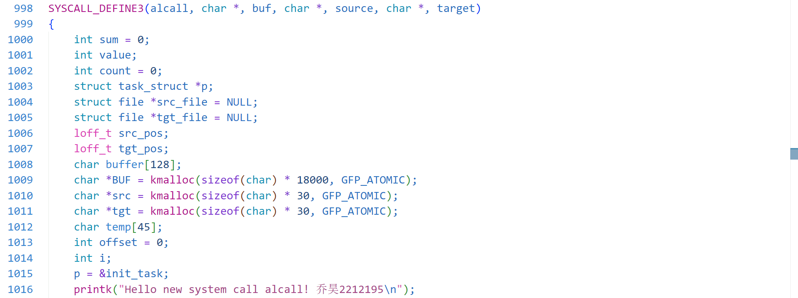
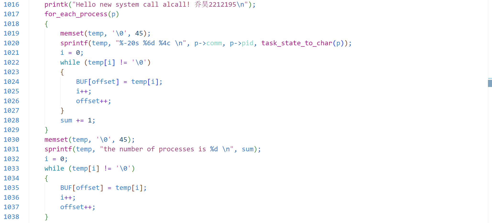
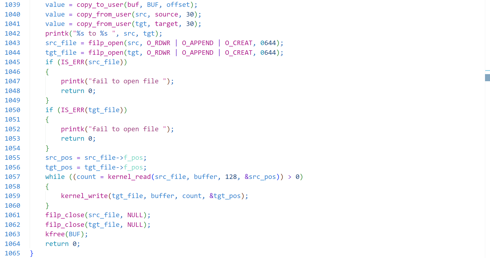
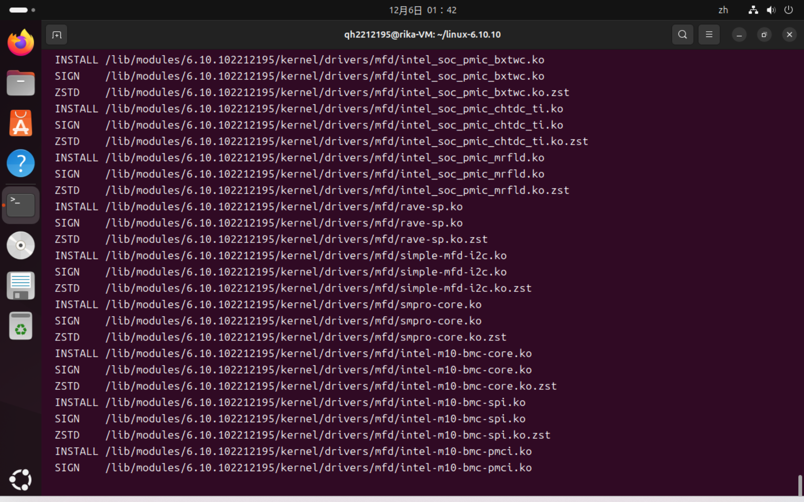
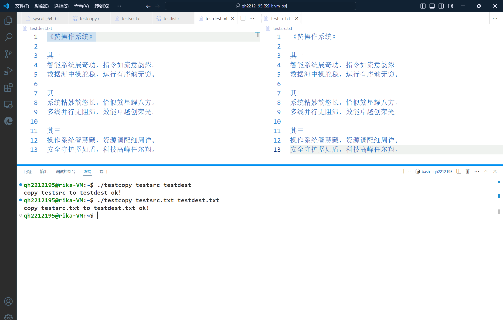

## <center>向 linux 内核添加系统调用实现文件夹拷贝</center>

#### <center>学院：软件学院</center>

#### <center>学号：2212195</center>

#### <center>姓名：&emsp;乔昊&emsp;</center>

### 实验目标

1. ##### 向 linux 内核中添加一个新的系统调用
2. ##### 测试用户模式下新的系统调用

### 实验准备

#### 安装开发工具

本次实验选用 GCC 编译工具

##### 安装 GCC

```
sudo apt-get install build-essential
```

#### 选择开发环境

vscode 编辑器

#### 准备 linux 内核

本次实验使用 linux-6.10.10 版本的 linux 内核

##### 查看系统内核

```
uname -a
```


### 实验过程

#### 添加 asmlinkage 宏定义

##### 在 **/usr/src/linux/include/linux** 目录下

1. 进入 **syscalls.h** 文件
2. 找到 **#endif /_ CONFIG_ARCH_HAS_SYSCALL_WRAPPER _/**
3. 添加 __asmlinkage long sys_alcall(char* buf, char* source, char\* target);__


#### 实现 SYSCALL_DEFINE3(alcall,char* buf, char* source, char\* target) 函数

##### 在 **/usr/src/linux/kernel** 目录下

1. 进入 **sys.c** 文件
2. 找到 **SYSCALL_DEFINE0(gettid)** 函数
3. 添加 __SYSCALL_DEFINE3(alcall,char* buf, char* source, char\* target)__ 函数

以下是实现列举进程信息的具体代码




**代码分析**
1. 分别从内核空间向用户空间拷贝数据以及从用户空间向内核空间拷贝数据
2. 使用file_open函数打开两个文件
3. 文件打开成功则获取文件的初始偏移量,循环使用kernel_read从源文件读取数据到buffer
4. 同时使用kernel_write将读取到的数据写入目标文件中

#### 添加 common schello sys_schello 命令

##### 在 **/usr/src/linux/arch/x86/entry/syscalls** 目录下

1. 进入 **syscall_64.tbl**文件
2. 添加 **336 common schello \_\_x64_sys_alcall**命令
   

#### 重新编译内核

1. ##### 清理项目`make clean`
2. ##### 编译内核`make -j5`
3. ##### 拷贝编译模块`sudo make modules_install`
4. ##### 安装内核映像`sudo make install`
5. ##### 重新启动`reboot`
   

#### 查看系统内核

执行`uname -a`命令


#### 编写用户态测试程序

##### 测试代码

```
#include <unistd.h>
#include <sys/syscall.h>
#include <sys/types.h>
#include <stdio.h>
#include <stdlib.h>
#define __NR_alcall 336
long alcall(char *buf, char *source, char *destination)
{
    return syscall(__NR_alcall, buf, source, destination);
}
int main(int argc, char *argv[])
{

    char *source = malloc(sizeof(char) * 30);
    char *destination = malloc(sizeof(char) * 30);
    source = argv[1];
    destination = argv[2];
    char *buf = malloc(sizeof(char) * 16000);
    printf("copy %s to %s", source, destination);
    alcall(buf, source, destination);
    printf(" ok! \n");
    free(buf);
    return 0;
}
```

##### 执行结果



### 实验总结

&emsp;&emsp;本次实验着重于在 Linux 内核中添加系统调用以实现文件拷贝功能。首先在 /usr/src/linux/include/linux 的 syscalls.h 文件中处理相关声明（此次无需重复添加 asmlinkage 宏定义）。核心步骤为在 /usr/src/linux/kernel 的 sys.c 文件里实现 SYSCALL_DEFINE3 (alcall, char* buf, char* source, char* target) 函数。此函数先从内核空间向用户空间拷贝数据以及反向拷贝，接着运用 file_open 函数打开源文件与目标文件，若文件打开成功，则获取其初始偏移量，通过循环使用 kernel_read 从源文件读取数据至 buffer，同时借助 kernel_write 将数据写入目标文件，以此达成文件拷贝目的。之后在 /usr/src/linux/arch/x86/entry/syscalls 的 syscall_64.tbl 文件中添加注册命令。最后执行重新编译内核操作，涵盖清理项目、编译内核、安装模块、安装内核映像以及重启系统等一系列步骤，确保新系统调用能正常运作。<br/>
&emsp;&emsp;本次实验,我掌握了在 sys.c 文件中编写代码实现文件拷贝功能，熟练运用内核文件操作函数如 file_open、kernel_read 和 kernel_write 等，深入理解其参数含义与使用场景。同时，完整地熟悉了内核编译与安装流程，知晓每个步骤的作用与可能出现的问题及解决方法。在编程思维与能力提升维度，进一步强化了 C 语言在内核环境下的运用能力，包括对指针、缓冲区操作以及函数返回值处理的精准把握。<br/>
&emsp;&emsp;本次实验开启了对 Linux 内核文件处理领域深入探索的大门，激发了我对内核其他文件相关功能开发的浓厚兴趣。深刻体会到系统级开发中对系统架构深入理解的极端重要性，在文件拷贝这一相对基础的功能开发中，就涉及到内核多模块、多函数的协同工作，任何对架构理解的偏差都可能导致功能无法实现或系统不稳定。这也促使我在今后的开发过程中必须始终保持严谨的编程态度，对每一个代码细节都要精益求精，确保代码的准确性与可靠性。<br/>
