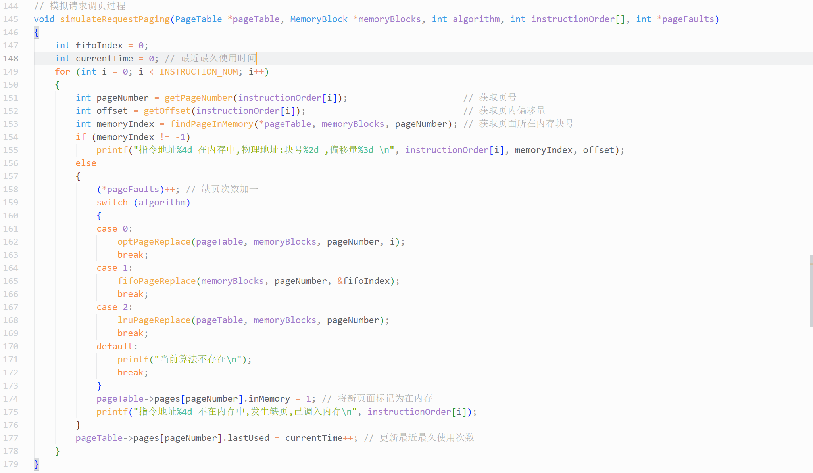

### <center>编写 C/C++程序 模拟请求调页存储管理的过程</center>

#### <center>学院:软件学院</center>

#### <center>学号:2212195</center>

#### <center>姓名:&emsp;乔昊&emsp;</center>

#### 实验目标

---

1. 编写 C 语言程序,模拟请求调页存储管理的过程
2. 实现对页面、页表、地址转换和页面置换的过程

#### 实验要求

---

##### 全局条件

- 假设每个页面中可存放 10 条指令,分配给一个作业的内存块数为 4;
- 一作业共有 320 条指令,即它的地址空间为 32 页,目前它的所有页都还未调入内存。

##### 页面置换规则

- 在模拟过程中,如果所访问的指令已在内存,则显示其物理地址,并转下一条指令。
- 如果所访问的指令还未装入内存,则发生缺页,此时需记录缺页的次数,并将相应页调入内存。
- 如果 4 个内存块均已装入该作业,则需进行页面置换。
- 最后显示其物理地址,并转入下一条指令。
- 在所有 320 条指令执行完毕后,计算并显示作业运行过程中发生的缺页率;

##### 指令访问次序

作业中指令的访问次序按下述原则生成:

1. 50%的指令是顺序执行的;
2. 25%的指令是均匀分布在前地址部分;
3. 25%的指令是均匀分布在后地址部分;

##### 置换算法

请分别考虑 OPT、FIFO 和 LRU 算法,并给出命中率;

$$
命中率=1-\frac{页面失效次数}{页地址流长度}
$$

#### 实验工具

---

1. **GCC 编译器**  
   本次实验使用 gcc 编译器,编译 C 语言程序文件
2. **vscode 编辑器**  
   本次实验使用 vscode 编辑 C 语言代码

#### 实验过程

---

##### 编写 C 语言程序

**代码实现逻辑和原理分析**

1. 变量宏定义
   
2. 页面结构体定义
   
3. 页表结构体定义
   
4. 内存块结构体定义
   
5. 初始化页表,内存块函数
   - 页表初始化
     
   - 内存块初始化
     
6. 初始化指令执行次序函数
   
7. 最佳置换算法 OPT
   
   - 依次遍历每个内存块,得到当前内存块所存的页面号
   - 从当前指令开始向后遍历,得到每个指令所属页面号
   - 如果遇到所属页面号与当前内存块所存的页面号相同的指令,停止遍历
   - 记录内存块所存页面的最久使用间隔
   - 替换内存块所存页面的最久使用间隔最大的页面
8. 先进先出算法 FIFO
   
   - 每一次置换,将先进先出索引模除内存块数
   - 由于是按照内存块序号进行页面调入,因此也按照内存块序号进行调出
9. 最近最久使用算法 LRU
   

- 记录每个指令所属页面的最近使用次数
- 依次遍历每个内存块,得到当前内存块所存的页面的最近使用次数
- 替换最近使用次数最小的页面,即最近最久使用的页面

10. 模拟请求调页过程
    
    - 获得当前指令所属页面号和页面内偏移量
    - 获得页面所存的内存块号
    - 如果页面已调入内存,则得到所属内存块号
    - 否则,进行页面置换,如果内存块有空闲,则会换入页面,不会换出页面
    - 更新页面的最近最久使用次数和页面的状态(是否调入)

##### 执行结果

1. OPT 置换算法
   
2. FIFO 置换算法
   
3. LRU 置换算法
   

##### 分析

- OPT 算法执行的效果是最好的,它选择未来最长时间不会被使用的页面进行替换,使得页面的命中率高.但在实际中,OPT 算法是无法实现的,因为操作系统无法预知指令在未来的时间内执行的次序
- LRU 算法执行的效果其次,它选择已经调入内存的且长时间未被使用的页面进行替换,在符合局部性原理的工作条件下性能很好,但实际中需要硬件提供支持,成本高.
- FIFO 算法实现简单,但性能差,可能会出现 Belady 异常(本实验没有体现)

#### 实验总结

---

&emsp;&emsp;本次实验旨在编写 C 语言程序模拟请求调页存储管理过程,深入理解并实现页面、页表、地址转换和页面置换等关键环节,并对 OPT、FIFO 和 LRU 三种页面置换算法进行性能分析。<br/>
&emsp;&emsp;OPT 算法虽然性能卓越,但因其需要预知未来指令序列,在实际操作系统中无法实现,主要用于理论研究和作为其他算法性能比较的基准。LRU 算法在性能上表现较好,但需要硬件支持来记录页面的使用顺序信息,这增加了系统的硬件成本和复杂度。在实验中,通过软件方式近似实现 LRU 算法,也能在一定程度上体现其优势,但与理论最优仍存在差距。FIFO 算法实现简单,不需要额外的硬件支持,但其性能相对较弱,在一些特定的访问模式下可能会出现 Belady 异常,导致随着内存块数量的增加,缺页率反而上升。<br/>
&emsp;&emsp;通过本次实验,将课堂上学到的请求调页存储管理理论知识转化为实际的代码实现,深入理解了页面置换算法的工作原理、页表和内存块的作用以及地址转换的过程。这种理论与实践的紧密结合,不仅加深了对知识的理解和掌握,还提高了自己的编程能力和解决实际问题的能力。亲身体验了不同页面置换算法在相同实验条件下的性能差异,深刻认识到算法选择对于系统性能的重要性。在实际的操作系统设计和优化中,需要根据系统的特点、应用场景和硬件资源等因素综合考虑,选择合适的页面置换算法,以平衡系统的性能和资源消耗。<br/>

#### 源代码

---

```
#include <stdio.h>
#include <stdlib.h>
#include <time.h>

#define PAGE_SIZE 10
#define MEMORY_BLOCKS 4
#define PAGE_NUM 32
#define INSTRUCTION_NUM 320

// 页面结构体,记录页面相关信息
typedef struct Page
{
    int pageNumber; // 页号
    int inMemory;   // 是否调入内存
    int lastUsed;   // 距上次访问未被访问的次数
} Page;

// 页表结构体,记录页表相关信息
typedef struct PageTable
{
    Page pages[PAGE_NUM];
} PageTable;

// 内存块结构体,记录内存块中的页面号
typedef struct MemoryBlock
{
    int pageNumber;
} MemoryBlock;

// 初始化页表,将所有页面标记为不在内存
void initPageTable(PageTable *pageTable)
{
    for (int i = 0; i < PAGE_NUM; i++)
    {
        pageTable->pages[i].pageNumber = i;
        pageTable->pages[i].inMemory = 0;
        pageTable->pages[i].lastUsed = 0;
    }
}

// 初始化内存块,将内存块中的页面号设为 -1(表示为空)
void initMemoryBlocks(MemoryBlock *memoryBlocks)
{
    for (int i = 0; i < MEMORY_BLOCKS; i++)
        memoryBlocks[i].pageNumber = -1;
}

// 根据指令地址获取页号
int getPageNumber(int instructionAddress)
{
    return instructionAddress / PAGE_SIZE;
}

// 根据指令地址获取页内偏移量
int getOffset(int instructionAddress)
{
    return instructionAddress % PAGE_SIZE;
}

// 查找页面是否在内存中,若在则返回所在内存块的索引,否则返回 -1
int findPageInMemory(PageTable pageTable, MemoryBlock memoryBlocks[], int pageNumber)
{
    for (int i = 0; i < MEMORY_BLOCKS; i++)
    {
        if (memoryBlocks[i].pageNumber == pageNumber)
            return i;
    }
    return -1;
}

// OPT算法进行页面置换
void optPageReplace(PageTable *pageTable, MemoryBlock *memoryBlocks, int pageNumber, int currentInstrcution)
{
    int farthest = -1;                      // 最久使用时间间隔
    int replaceIndex = -1;                  // 要替换页面所在的块号
    for (int i = 0; i < MEMORY_BLOCKS; i++) // 遍历得到每个块内页面下次被访问的时间间隔
    {
        int currentPageNumber = memoryBlocks[i].pageNumber;
        int j = currentInstrcution;
        while (j < INSTRUCTION_NUM)
        {
            if (getPageNumber(j) == currentPageNumber) {
                break;
            }
            j++;
        }
        if (j > farthest)
        {
            farthest = j;
            replaceIndex = i;
        }
    }
    memoryBlocks[replaceIndex].pageNumber = pageNumber;
}

// FIFO算法进行页面置换
void fifoPageReplace(MemoryBlock *memoryBlocks, int pageNumber, int *fifoIndex)
{
    memoryBlocks[*fifoIndex].pageNumber = pageNumber;
    *fifoIndex = (*fifoIndex + 1) % MEMORY_BLOCKS; // 更新先进先出索引
}

// LRU算法进行页面置换
void lruPageReplace(PageTable *pageTable, MemoryBlock *memoryBlocks, int pageNumber)
{
    int leastRecentlyUsed = 0;
    int currentTime = 320;
    // 获得最近最久使用的页面号
    for (int i = 0; i < MEMORY_BLOCKS; i++)
    {
        if (pageTable->pages[memoryBlocks[i].pageNumber].lastUsed < currentTime)
        {
            currentTime = pageTable->pages[memoryBlocks[i].pageNumber].lastUsed;
            leastRecentlyUsed = i;
        }
    }
    memoryBlocks[leastRecentlyUsed].pageNumber = pageNumber;
}

/*
生成指令访问次序
1. 50%为逆序
2. 25%在低地址
3. 25%在高地址
*/
void generateInstructionOrder(int instructionOrder[])
{
    srand((unsigned int)time(NULL));
    int m = rand() % INSTRUCTION_NUM;
    int index = 0;
    instructionOrder[index++] = m;
    instructionOrder[index++] = m + 1;
    while (index < INSTRUCTION_NUM)
    {
        int m1 = rand() % m;
        instructionOrder[index++] = m1;
        instructionOrder[index++] = m1 + 1;
        int m2 = rand() % (INSTRUCTION_NUM - (m1 + 2)) + (m1 + 2);
        instructionOrder[index++] = m2;
        instructionOrder[index++] = m2 + 1;
    }
}

// 模拟请求调页过程
void simulateRequestPaging(PageTable *pageTable, MemoryBlock *memoryBlocks, int algorithm, int instructionOrder[], int *pageFaults)
{
    int fifoIndex = 0;
    int currentTime = 0; // 最近最久使用时间
    for (int i = 0; i < INSTRUCTION_NUM; i++)
    {
        int pageNumber = getPageNumber(instructionOrder[i]);                      // 获取页号
        int offset = getOffset(instructionOrder[i]);                              // 获取页内偏移量
        int memoryIndex = findPageInMemory(*pageTable, memoryBlocks, pageNumber); // 获取页面所在内存块号
        if (memoryIndex != -1)
            printf("指令地址%4d 在内存中,物理地址:块号%2d ,偏移量%3d \n", instructionOrder[i], memoryIndex, offset);
        else
        {
            (*pageFaults)++; // 缺页次数加一
            switch (algorithm)
            {
            case 0:
                optPageReplace(pageTable, memoryBlocks, pageNumber, i);
                break;
            case 1:
                fifoPageReplace(memoryBlocks, pageNumber, &fifoIndex);
                break;
            case 2:
                lruPageReplace(pageTable, memoryBlocks, pageNumber);
                break;
            default:
                printf("当前算法不存在\n");
                break;
            }
            pageTable->pages[pageNumber].inMemory = 1; // 将新页面标记为在内存
            printf("指令地址%4d 不在内存中,发生缺页,已调入内存\n", instructionOrder[i]);
        }
        pageTable->pages[pageNumber].lastUsed = currentTime++; // 更新最近最久使用次数
    }
}

void printPageFaultRate(int pageFaults, int algorithm)
{
    double pageFaultRate = (double)pageFaults / INSTRUCTION_NUM; // 计算缺页率
    double hitRate = 1 - pageFaultRate;                          // 计算命中率
    switch (algorithm)
    {
    case 0:
        printf("使用OPT最佳置换算法:");
        break;
    case 1:
        printf("使用FIFO先进先出算法:");
        break;
    case 2:
        printf("使用LRU最近最久使用算法:");
        break;
    default:
        break;
    }
    printf("缺页率:%.2f,命中率:%.2f\n", pageFaultRate, hitRate); // 打印结果
}

int main()
{
    PageTable pageTable;
    MemoryBlock memoryBlocks[MEMORY_BLOCKS];
    int instructionOrder[INSTRUCTION_NUM];
    int pageFaults[3] = {0, 0, 0}; // 缺页次数

    generateInstructionOrder(instructionOrder); // 生成随机指令序列

    // OPT算法模拟
    initPageTable(&pageTable); // 初始化页表
    initMemoryBlocks(memoryBlocks); // 初始化内存块
    simulateRequestPaging(&pageTable, memoryBlocks, 0, instructionOrder, &pageFaults[0]);
    printPageFaultRate(pageFaults[0], 0);

    // FIFO算法模拟
    initPageTable(&pageTable); // 初始化页表
    initMemoryBlocks(memoryBlocks); // 初始化内存块
    simulateRequestPaging(&pageTable, memoryBlocks, 1, instructionOrder, &pageFaults[1]);
    printPageFaultRate(pageFaults[1], 1);

    // LRU算法模拟
    initPageTable(&pageTable); // 初始化页表
    initMemoryBlocks(memoryBlocks); // 初始化内存块
    simulateRequestPaging(&pageTable, memoryBlocks, 2, instructionOrder, &pageFaults[2]);
    printPageFaultRate(pageFaults[2], 2);

    return 0;
}
```
